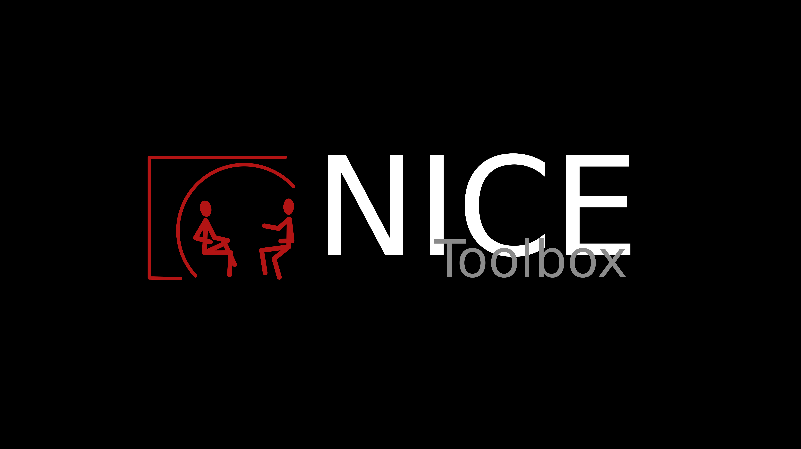

# Nonverbal Interpersonal Communication Exploration Toolbox

&emsp;&emsp;&emsp;
[Project page](https://nice.is.tue.mpg.de/) &emsp;&emsp;&emsp;
[Documentation](https://nicetoolbox.readthedocs.io/en/stable/index.html) &emsp;&emsp;&emsp;
[Changelog](https://nicetoolbox.readthedocs.io/en/stable/link_changelog.html) &emsp;&emsp;&emsp;
<nicetoolbox@tue.mpg.de>

 

> 🚀 We are releasing a new 0.3.1 version that adds new [UniGaze](https://github.com/ut-vision/UniGaze) gaze estimation, [CrisperWhisper](https://github.com/nyrahealth/CrisperWhisper) audio transcription, [InsightFace](https://github.com/deepinsight/insightface) face analysis, eye closure and blink detection, [Py-Feat](https://github.com/cosanlab/py-feat) updated to a new version, audio evaluation metrics, a reworked installation, and many other improvements and fixes. Please check [the changelog](https://nicetoolbox.readthedocs.io/en/stable/link_changelog.html) for more information.

NICE Toolbox is an easy-to-use framework for exploring nonverbal human communication.
It aims to enable the investigation of observable signs that reflect the mental state
and behaviors of the individual. Additionally, these visual nonverbal cues reveal the
interpersonal dynamics between people in face-to-face conversations.

NICE combines existing computer vision **detectors** into a single, easy-to-use framework. Working from single- or multi-camera video data, it covers whole-body pose estimation, gaze tracking, movement dynamics (kinematics), gaze interaction monitoring (mutual gaze), physical proximity between dyads, emotion detection and more. For a full list, see the [components overview](https://nicetoolbox.readthedocs.io/en/stable/wikis/wiki_components.html) and [supported algorithms](https://nicetoolbox.readthedocs.io/en/stable/wikis/wiki_algorithms.html) pages.

The toolbox also includes a **visualizer** module for interactively exploring outputs, an **evaluation** module that runs configurable metrics and a collection of **connectors** for importing/exporting data to third-party tools (e.g. for labelling in [ELAN](https://archive.mpi.nl/tla/elan) or [napari-deeplabcut](https://github.com/DeepLabCut/napari-deeplabcut)).

If you have additional questions or would like to collaborate on a project using NICE Toolbox, please reach out to us at <nicetoolbox@tue.mpg.de>.

## Installation & Getting Started

For instructions on installing the toolbox on a Linux or Windows machine, please see the
[installation instructions](https://nicetoolbox.readthedocs.io/en/stable/installation.html)
page. For a quick start into the toolbox, we provide an example dataset and documentation to
set it up on the [getting started](https://nicetoolbox.readthedocs.io/en/stable/getting_started.html)
page. Further tutorials and documentation can be found on the
[tutorials](https://nicetoolbox.readthedocs.io/en/stable/tutorials/index.html) and
[wiki](https://nicetoolbox.readthedocs.io/en/stable/wikis/index.html) pages. You can also
access this [documentation](https://nicetoolbox.readthedocs.io/en/stable/index.html) offline
by downloading it as a PDF. Just use the ReadTheDocs pop-up menu located in the bottom right
corner of the screen.

## Acknowledgments

We acknowledge the following tools, methods, and frameworks:
[MMPose](https://github.com/open-mmlab/mmpose/tree/main),
[HigherHRNet](https://github.com/HRNet/HigherHRNet-Human-Pose-Estimation/tree/master),
[ViTPose](https://github.com/ViTAE-Transformer/ViTPose/tree/main),
[DarkPose](https://github.com/ilovepose/DarkPose/tree/master),
[RTMPose](https://github.com/open-mmlab/mmpose/tree/main/projects/rtmpose),
[MotionBERT](https://arxiv.org/abs/2210.06551),
[SAM 3D Body](https://github.com/facebookresearch/sam-3d-body),
[SAM 2](https://github.com/facebookresearch/sam2),
[MoGe](https://github.com/microsoft/MoGe),
[Detectron2](https://github.com/facebookresearch/detectron2),
[ETH-XGaze](https://github.com/xucong-zhang/ETH-XGaze),
[UniGaze](https://github.com/ut-vision/UniGaze),
[SPIGA](https://github.com/andresprados/SPIGA),
[InsightFace](https://github.com/deepinsight/insightface),
[face-alignment](https://github.com/1adrianb/face-alignment),
[WhisperX](https://github.com/m-bain/whisperx),
[CrisperWhisper](https://github.com/nyrahealth/CrisperWhisper),
[Py-Feat](https://py-feat.org/), and
[rerun.io](https://rerun.io/).

## Authors

Aleksandr Evgrashin,
Carolin Schmitt,
Timo Lübbing,
Ashutosh Jha,
Buket Naz Zeren,
Sophie Bauer,
Gökce Ergün,
Senya Polikovsky.

All authors are with the Optics and Sensing Laboratory at Max Planck Institute for Intelligent Systems.

We thank the [MPI-IS Software Workshop](https://is.mpg.de/en/software-workshop) for their thoughtful feedback and support during the project refactoring. 

## License

[NICE Toolbox](https://github.com/OSLabTools/nicetoolbox) © 2026 Max-Planck-Gesellschaft zur Förderung der Wissenschaften e.V. is licensed under
[AGPL-3.0](https://www.gnu.org/licenses/agpl-3.0.html), see [LICENSE](https://github.com/OSLabTools/nicetoolbox/blob/main/LICENSE).

NICE Toolbox has optional support for third-party algorithms and models that are distributed under their own licenses. See [LICENSES_ALGORITHMS.md](https://github.com/OSLabTools/nicetoolbox/blob/main/LICENSES_ALGORITHMS.md) for the full list.
