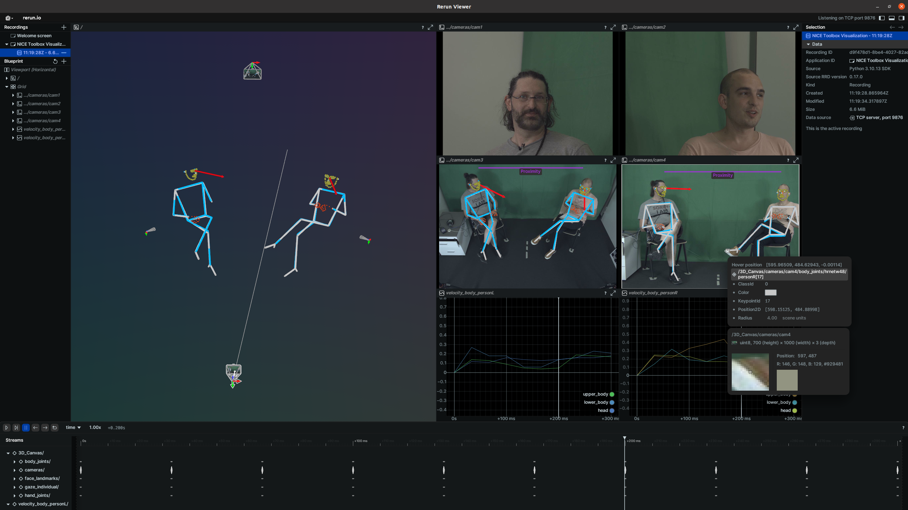

# Getting started

## Contents  <!-- omit in toc -->

1. [Create your machine-specific config](#1-create-your-machine-specific-config)
2. [Download the example data](#2-download-the-example-data)
3. [Define the dataset's properties](#3-define-the-datasets-properties)
4. [Add the experiment to run](#4-add-the-experiment-to-run)
5. [Run the NICE Toolbox](#5-run-the-nice-toolbox)
6. [Visualize the results](#6-visualize-the-results)

<br>

## 1. Create your machine-specific config

Create a file `./machine_specific_paths.toml`, you can also copy and rename the file `./machine_specific_paths_template.toml`.
This machine specific configuration file should contain the following dictionary (to fill):

```toml
# Absolute path to the directory in which all datasets are stored (str)
datasets_folder_path = ''

# Directory for saving toolbox output as an absolute path (str)
output_folder_path = ''

# Where to find your conda (miniconda or anaconda) installation as absolute path (str)
conda_path = ''
```

## 2. Download the example data
The example data is uploaded to [keeper](https://keeper.mpdl.mpg.de/d/d38179804e1144a5880d/). Please download the folder `communication_multiview` and put it in your `datasets_folder_path` - the directory which is defined in your file `./machine_specific_paths.toml`, see above ([1. Create your machine-specific config](#1-create-your-machine-specific-config)). 


### 3. Define the dataset's properties
Check that the file `./detectors/configs/dataset_properties.toml` contains the following dictionary:
```toml
[communication_multiview]
session_IDs = ["session_xyz"]
sequence_IDs = ['']
cam_front = 'view_center'
cam_top = 'view_top'
cam_face1 = 'view_left'
cam_face2 = 'view_right'
subjects_descr = ["person_left", "person_right"]
cam_sees_subjects = {view_center = [0, 1], view_top = [0, 1], view_left = [0], view_right = [1]} 
path_to_calibrations = "<datasets_folder_path>/communication_multiview/calibrations.npz"
data_input_folder = "<datasets_folder_path>/communication_multiview/<session_ID>/"
start_frame_index = 0
fps = 30
```
A detailed description of this file can be found in [Tutorial 1 - prepare the dataset](tutorial1_new_dataset.md#1-prepare-the-dataset).


## 4. Add the experiment to run
To run the NICE toolbox on our new dataset, we need to specify what exactly we want to run in our experiment. Open `./detectors/configs/run_file.toml` and make sure that the `[run]` dictionary details the following:

```toml
[run]
[run.communication_multiview]
components = ["body_joints", "gaze_individual", "gaze_interaction", "kinematics", "proximity", "leaning"]
videos = [
   {session_ID = "session_xyz", sequence_ID='', video_start = 0, video_length = 99, video_skip_frames = false},
]

```
More details can be found in [Tutorial 1 - define the experiment](tutorial1_new_dataset.md#3-define-the-experiment-to-run).


## 5. Run the NICE Toolbox
To run the toolbox, open a terminal or the API of your choice and execute:

```bash
# navigate to the NICE toolbox source code folder
cd /path/to/isa-tool/

# activate the python environment
source ./env/bin/activate

# run the toolbox
python detectors/main.py
```

The outputs will be saved in the folder defined in `./detectors/configs/run_file.toml` under `io.out_folder` (with filled-in placeholders). 
To watch the experiment run, check the log file `.../<out_folder>/ISA-Tool.log`. Expect the tool to take about 6min for this experiment.


## 6. Visualize the results

There are multiple options to visualize the results of NICE toolbox. 
For an interactive experience, we recommend to use our `visual` code which is running `rerun`. 
To do so, open `/isa-tool/visual/configs/visualizer_config.toml` and update the entries `io.experiment_folder` and `media.video_name`:

```toml
[io]
dataset_folder = "<datasets_folder_path>"
nice_tool_input_folder = "<output_folder_path>/raw_processed/isa_tool_input/<dataset_name>_<session_ID>_<sequence_ID>" 
experiment_folder = "<output_folder_path>/experiments/..."  # add the path to your output folder (the one containing the file 'ISA-Tool.log')
experiment_video_folder = "<experiment_folder>/<video_name>" 
experiment_video_component = "<experiment_folder>/<video_name>/<component_name>"

[media]
mode = 'isa-tool'
dataset_name = 'communication_multiview'
video_name = 'communication_multiview_session_xyz_s0_l99' # the folder name that got created inside your experiment_folder
multi_view = true
```

And last, from inside the top level of your code folder, start the visualizer by running
```bash
source ./env/bin/activate
python visual/media/main.py
```

It will open a window which looks similar to this: 



