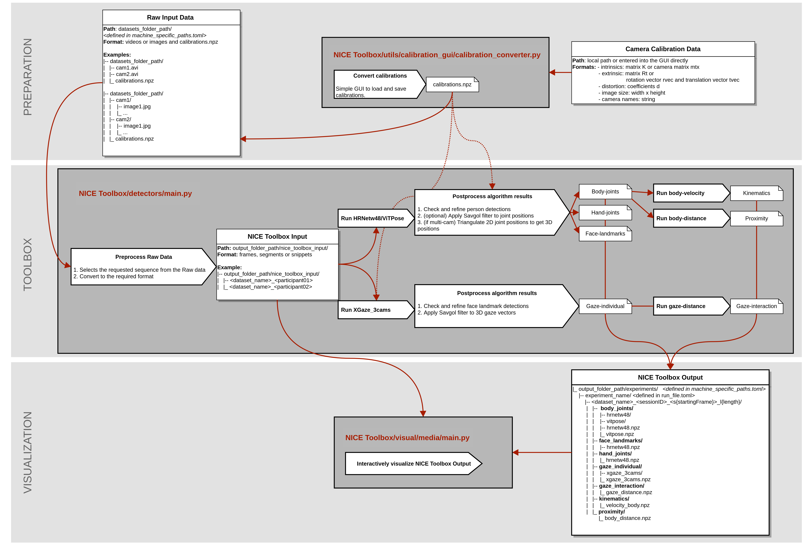

.. toctree::
   :hidden:

   Project Overview <self>
   Installation <installation>
   Getting started <getting_started>
   tutorials/index
   wikis/index
   API <_autosummary/nicetoolbox>

Welcome to NICE Toolbox's documentation!
========================================

.. video:: ./graphics/nicetoolbox_480p.mp4

Non-Verbal Interpersonal Communication Exploration Toolbox
----------------------------------------------------------

Project page: `https://nice.is.tue.mpg.de/ <https://nice.is.tue.mpg.de/>`__

NICE Toolbox is an easy-to-use framework for exploring nonverbal human communication.
It aims to enable the investigation of observable signs that reflect the mental state
and behaviors of the individual. Additionally, these visual nonverbal cues reveal the
interpersonal dynamics between people in face-to-face conversations.

NICE Toolbox incorporates a growing set of Computer Vision algorithms to track and
identify important visual components of nonverbal communication. Existing deep-learning
and rule-based algorithms are combined into a single, easy-to-use software toolbox.
Based on single- or multi-camera video data, the initial release encompasses whole-body
pose estimation and gaze tracking for each individual, as well as movement dynamics
calculation (kinematics), gaze interaction monitoring (mutual-gaze), and the measurement
of physical body distance between dyads.
This first set of components and algorithms is going to be extended in future releases.
For more details, please see the :doc:`components overview <wikis/wiki_components>` page in
the wiki.

The toolbox  also includes a visualizer module, which allows users to
visualize and investigate the algorithm’s outputs.

Installation & getting started
------------------------------

For instructions on installing the toolbox on a Linux or Windows machine, please see the
:doc:`installation instructions <installation>` page.
For a quick start into the toolbox, we provide an example dataset and documentation to
set it up on the :doc:`getting started <getting_started>` page.
Further tutorials and documentation can be found on the :doc:`tutorials <tutorials/index>`
and :doc:`wiki <wikis/index>` pages.

Code Structure
--------------

Future releases
---------------

In future releases, we plan to extend the NICE Toolbox to include detectors for facial
expressions, head movements, eye closure, active speaking, emotional valence and arousal,
and micro-action recognition.

Further, we will move beyond mere visual inspection and integrate a versatile
evaluation framework. Based on our experience in computer vision, we are aware that no
single algorithm can perform flawlessly across all capture settings.
To help you choose the best algorithms for your settings, we are developing an evaluation
workflow. This workflow will clarify the limitations of the algorithms, allow for systematic
comparisons, and assess their accuracy within a given setting.
Our goal is to provide comprehensive and objective evaluations of the algorithms,
ultimately creating a practically useful toolbox for researchers analyzing human
interaction and communication.

If you are interested in collaborating with us or contributing to the project, please
reach out to us at **nicetoolbox@tue.mpg.de**.

Acknowledgments
---------------

The NICE Toolbox is using the following existing tools, methods, and frameworks:
`MMPose <https://github.com/open-mmlab/mmpose/tree/main>`__,
`HigherHRNet <https://github.com/HRNet/HigherHRNet-Human-Pose-Estimation/tree/master>`__,
`ViTPose <https://github.com/ViTAE-Transformer/ViTPose/tree/main>`__,
`DarkPose <https://github.com/ilovepose/DarkPose/tree/master>`__,
`ETH-XGaze <https://github.com/xucong-zhang/ETH-XGaze>`__, and
`rerun.io <https://rerun.io/>`__.

Authors
-------

Carolin Schmitt
Gökce Ergün
Timo Lübbing
Senya Polikovsky

All authors are with the Optics and Sensing Laboratory at Max-Planck Institute for Intelligent Systems.

License
-------

`NICE Toolbox <https://github.com/OSLabTools/nicetoolbox>`__ © 2024 by Carolin Schmitt, Gökce Ergün, 
Timo Lübbing, Senya Polikovsky is licensed under 
`CC BY-NC-SA 4.0 <https://creativecommons.org/licenses/by-nc-sa/4.0/?ref=chooser-v1>`__
, see :doc:`LICENSE.md <LICENSE>`.

Some components of the NICE Toolbox further use algorithms that are being distributed under other licenses 
listed in :doc:`LICENSES_ALGORITHMS.md <LICENSES_ALGORITHMS>`.

Copyright
---------

Copyright 2024, Max Planck Society / Optics and Sensing Laboratory - Max Planck Institute for Intelligent Systems
