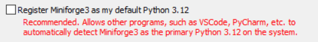

# Installation

We conducted tests of the installation on Windows 11 and Ubuntu versions 20 and 22, using CUDA 11.8.

<!-- TOC -->
1. [Clone the repositories](#1-clone-the-repository)
2. [Download assets](#2-download-assets)
3. [Prerequisites](#3-prerequisites)
    - [Python 3.10](#python-310)
    - [Conda](#conda)
    - [Cuda 11.8](#cuda-118)
    - [FFmpeg](#ffmpeg)
    - [On Windows: Turn developer mode on](#on-windows-turn-developer-mode-on)
4. [Install the necessary libraries](#4-install-the-necessary-libraries)
    - [On Linux](#on-linux)
    - [On Windows](#on-windows)
5. [Additional notes](#5-additional-notes)
<!-- TOC -->


## 1. Clone the repository

Before cloning the repository, install git if it is not installed yet.
INstructions can be found [here](https://git-scm.com/book/en/v2/Getting-Started-Installing-Git).
Then clone the NICE Toolbox repository and navigate into its folder:

! TODO: UPDATE RENAME OF THE REPOSITORIES

```bash
git clone git@gitlab.tuebingen.mpg.de:cschmitt/isa-tool.git 
cd nicetoolbox
```


## 2. Download assets
Assets are uploaded to [keeper](https://keeper.mpdl.mpg.de/d/a9f91e7e60e84da69fc0/).
Please download the folder put it in `nicetoolbox/detectors/assets`.


## 3. Prerequisites

### Python 3.10
Please find the download links under the [official python](https://www.python.org/downloads/) pages.
If you are a Windows user, please add python to your `PATH` variable as explained on [educative.io](https://www.educative.io/answers/how-to-add-python-to-path-variable-in-windows).


### Conda
Conda can be installed through different installers, see [conda.io](https://conda.io/projects/conda/en/latest/user-guide/install/index.html). A popular one is the Anaconda Distribution -- it uses the anaconda channel by default which is subject to specific licensing.
An alternative option is the [Miniforge](https://github.com/conda-forge/miniforge) installer, which uses the [conda-forge](https://conda-forge.org/) channel and comes with open-source packages.
Please find instructions to install Miniforge on their [official website](https://github.com/conda-forge/miniforge).

If you installed Conda through Anaconda, you can switch to the free conda-forge channel following these steps:
```bash
# check what is currently set
conda config --show channels

# remove all channels other than conda-forge 
conda config --remove channels defaults

# add conda-forge if not already present
conda config --add channels conda-forge
``` 


> [!IMPORTANT]
> During the installation of Conda, it is **crucial not to select** the option to register Conda's Python as the default Python interpreter. 
This is because the Nice Toolbox requires **Python version 3.10** to be set as the default.
>
>
>Selecting this option during installation may result in errors or conflicts, as Conda's Python version may differ from the required version for NiceToolbox. To ensure proper functionality, make sure Python 3.10 remains your default version.


### Cuda 11.8 
Please find installation instructions on the official websites: for [Windows](https://docs.nvidia.com/cuda/cuda-installation-guide-microsoft-windows/index.html) and Linux [Ubuntu](https://docs.nvidia.com/cuda/cuda-installation-guide-linux/index.html).

### FFmpeg
On Linux Ubuntu, please find detailed instructions [here](https://phoenixnap.com/kb/install-ffmpeg-ubuntu).

On Windows, you can follow [phoenixnap.com](https://phoenixnap.com/kb/ffmpeg-windows):
1. Visit the official [FFmpeg website](https://ffmpeg.org/download.html) to get the latest version 
of the FFmpeg package and binary files. 
2. Hover over the Windows icon with your mouse and click on 'Windows builds from gyan.dev'
3. This redirects you to a page having FFmpeg binaries. Install the latest git master branch build, 
e.g., ffmpeg-git-essentials.7z.
4. Extract the downloaded files and rename the extracted folder as ffmpeg.
5. Move the folder to the root of the C drive or the folder of your choice.
6. Add FFmpeg to `PATH` in Windows environment variables.


### On Windows: Turn developer mode on
Nice Toolbox creates symlinks. To enable these, please enable Developer Mode on Windows.
This can be done by going to `Settings` > `Updates&Security` > `For Developers` and turning Developer Mode to on.


TODO -- check if it creates any security risk (windows gives a warning about) and whether there is a better way to do it.


## 4. Install the necessary libraries

Installation scripts are provided for Linux and Windows under `nicetoolbox/installation/install_all.sh` and `nicetoolbox/installation/install_all.bat`. They presume that Conda, CUDA 11.8, and Python 3.10 are already installed on your system. 
Both will do the following: 
1. Setup Nice Toolbox environment
2. Setup conda environment for Openmmlab (pose detector)
3. Setup venv environment for Gaze Detector


**Notes:**
Conda is needed for the openmmlab installation (a pose detector). 
And if you wish to use different versions of Python and CUDA, you can modify the corresponding lines in the installation files.


### On Linux
Open a terminal and navigate to the directory of the repository, then add executable permission to the installation script and install the toolbox:

```bash
cd /path/to/nicetoolbox/
chmod +x ./installation/install_all.sh  # to add executable permission to the script
./installation/install_all.sh           # to install all necessary libraries
```

### On Windows 
Open a command line and navigate to the directory of the repository and install the toolbox:

```bash
cd \path\to\nice-toolbox
.\installation\install_all.bat  # to install all necessary libraries
```


## 5. Additional notes
Please check [rerun privacy policies](https://www.rerun.io/privacy).
Although rerun.io is used in local mode, the application will be collecting user information. To disable these analytics, activate the code environement in `envs/` and then run: 
```bash
rerun analytics config   ##to see current configuration
rerun analytics disable 
rerun analytics config   ## to check if the change is applied
```
More information can be found [here](https://github.com/rerun-io/rerun/blob/main/crates/re_analytics/README.md).
