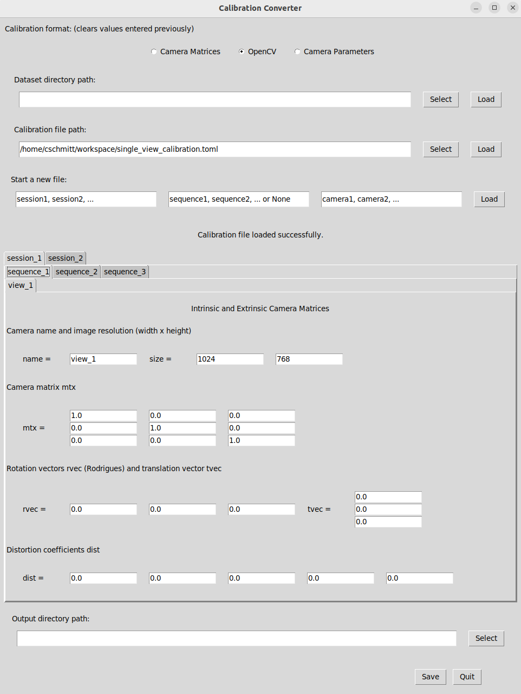

# Include a dataset with a single camera view

This tutorial explains how to run the NICE Toolbox on your own dataset. It covers datasets that contain videos of a single camera, without multi-view captures. 

If you are running the NICE Toolbox for the first time, please note that there is quick start guide as well - the [getting started](../getting_started.md) page explains how to run the NICE Toolbox on an example dataset.

<br>


1. [Create your machine-specific config](#1-create-your-machine-specific-config)
2. [Prepare the dataset](#2-prepare-the-dataset)
    - [Folder structure](#folder-structure)
    - [Dataset properties](#dataset-properties)
    - [Example](#example)
3. [Create a calibration file](#3-create-a-calibration-file)
    - [Calibration toml file](#calibration-toml-file)
    - [Toml to npz file](#toml-to-npz-file)
4. [Define the experiment to run](#4-define-the-experiment-to-run)  
5. [Run the toolbox](#5-run-the-toolbox)

<br>


## 1. Create your machine-specific config

Create a file `./machine_specific_paths.toml`, you can also copy and rename the file `./machine_specific_paths_template.toml`.
For more information, see [machine-specific config](../getting_started.md#1-create-your-machine-specific-config).

**Placeholders instead of absolute paths:** Note that it is best practice not to use absolute paths in any other files in the NICE Toolbox Though absolute pahts do not cause errors, they hinder collaboration and greatly decrease the readability of code. 
Instead, `datasets_folder_path` and `conda_path` are available in the other config files in `./detectors/configs/` as placeholders - use as `<datasets_folder_path>` and `<conda_path>` directly in strings.


## 2. Prepare the dataset

The NICE Toolbox supports datasets with video or image input data, multiple camera views, different number of subjects (1 or 2 currently), as well as various folder structures. These dataset-specific details are defined in `./detectors/configs/dataset_properties.toml`. To add a new dataset, first check and potentially adjust the dataset's folder structure, and then update the dataset properties file as described in the following. You can find an example at the end of this section.


### Folder structure

The code expects the data folder to have a pre-defined folder structure:
`dataset_name/session_name/sequence_name(optional)/camera_name(optional)`
Supported data formats are `.mp4`, `.avi`, `.png`, `.jpg`, `.jpeg`. Examples for valid folder structures are:

```
dataset_name/
├── session_name/
│   ├── sequence_name/
│   │   ├── camera_name/
│   │   │   ├── image1.png
│   │   │   ├── image2.png
...
```

```
dataset_name/
├── session_name/
│   ├── camera_name.mp4
...
```

Note: the `calibration_file` (which also belongs to the dataset) does not have a specific location, as its filepath is defined in `./detectors/configs/dataset_properties.toml`, see below.


### Dataset properties

To add the new dataset to the toolbox, edit the file `./detectors/configs/dataset_properties.toml` by creating a new dictionary within:

```toml
[dataset_name]
session_IDs = ['']        # identifiers for each session (list of str)
sequence_IDs = ['']       # identifiers for individual sequences (list of str)
cam_front = ''            # name of the camera with the most frontal view (str)
cam_top = ''              # camera name of a frontal view from top (str, optional)
cam_face1 = ''            # camera name of a view of one subject's face (str, optional)
cam_face2 = ''            # caemra name of a view of a second subject's face (str, optional)
subjects_descr = []       # define an identifier for the subjects in each video or frame (list of str)
cam_sees_subjects = {}    # define which camera view records which subject (dict: (cam_name, list of int))
path_to_calibrations = "" # file path with placeholders for the calibration files (str, optional)
data_input_folder = ""    # folder path with placeholders to the video or image files (str)
start_frame_index = 0     # how does the dataset index its data? usually, starting with 0 or 1 (int)
fps = 30                  # frame-rate of video data (int, optional)
```

A few notes:
- `cam_front` should contain the name of the camera view that observes the scene from the front. Best, it faces the subjects at about eye-height. 
- `cam_top`, `cam_face1`, and `cam_face2` are only used for multi-view datasets. These can be left as an empty string.
- `subjects_descr` The length of this list reflects the number of people visible in the data. For each person visible, add an identifier.
- `cam_sees_subjects` is a dictionary and its keys are the camera_names from above. For each camera, define the subjects it observes from left to right. Hereby, each subject is represented by its index in subjects_descr, where indexing starts with 0. See the example below.
- `path_to_calibrations` and `data_input_folder` may (or in most cases must) contain placeholders. Placeholders can be the strings `<session_ID>`, `<sequence_ID>`, or `<datasets_folder_path>`.

A comprehensive and detailed description of the dataset properties file can also be found on the wiki page on config files under [dataset properties](../wikis/wiki_config_files.md#dataset-properties).


### Example

Assume we have a dataset called "test_dataset" that contains video sequences from 2 capture sessions and 3 video sequences per session. The setup of the data is as follows: a single camera records two people sitting next to each other and talking. The camera captures at a framerate of 30 frames per second and the dataset provides frames that are indexed starting from 0.
Further suppose that the dataset directory the following folder structure:

```
test_dataset/
├── session_1/
│   ├── sequence_1/
│   │   └── view_1/
│   ├── sequence_2/
│   │   └── view_1/
│   └── sequence_3/
│       └── view_1/
├── session_2/
│   ├── sequence_1/
│   │   └── view_1/
│   ├── sequence_2/
│   │   └── view_1/
│   └── sequence_3/
│       └── view_1/
└── calibration.npz
```

To add this dataset to the NICE Toolbox, we need to add the following lines to `./detectors/configs/dataset_properties.toml`:

```toml
[test_dataset]                                             # folder name of the dataset
session_IDs = ["session_1", "session_2"]                   # folder name of the sessions
sequence_IDs = ['sequence_1', 'sequence_2', 'sequence_3']  # folder name of the sequences
cam_front = 'view_1'                                       # a single camera recording from the front
cam_top = ''                                               # no other cameras, leave empty strings
cam_face1 = ''
cam_face2 = ''
subjects_descr = ["personL", "personR"]                    # there are 2 people visible in the video
cam_sees_subjects = {view_1 = [0, 1]}                      # one camera ("view_1") and the order of the subjects named in 'subjects_descr'
path_to_calibrations = "<datasets_folder_path>/test_dataset/calibration.npz"           # where to find the calibration file (reflects the folder structure above)
data_input_folder = "<datasets_folder_path>/test_dataset/<session_ID>/<sequence_ID>/"  # where to find the video/frames data (reflects the folder structure above) 
start_frame_index = 0                                      # the dataset provides frames that are indexed starting from 0
fps = 30                                                   # the camera captures at a framerate of 30 frames per second
```

## 3. Create a calibration file

The NICE Toolbox expects a `calibration.npz` file containing the calibration details of the cameras for each dataset. In the single-view case, it can be created by the following two steps: 


### Calibration toml file

Create a `single_view_calibration.toml` file that contains the following dictionary for each of your session_IDs and sequence_IDs:
```toml
[<session_ID>__<sequence_ID>.<camera_name>]   # enter your session_ID, sequence_ID, and camera_name
camera_name = "<camera_name>"                 # enter the camera_name
image_size = [ <width>, <height> ]            # provide the image resolution (width and height) in pixels
mtx = [ [1.0, 0.0, 0.0], [0.0, 1.0, 0.0], [0.0, 0.0, 1.0] ]
dist = [ 0.0, 0.0, 0.0, 0.0, 0.0 ]
rvec = [ 0.0, 0.0, 0.0 ]
tvec = [ [0.0], [0.0], [0.0] ]
```
Recalling the [example](#example) from the previous section, please find the accompaniing `single_view_calibration.toml` for this example on [keeper](https://keeper.mpdl.mpg.de/d/cdaa6540e0db4a63bbf9/) to download.


### Toml to npz file

Next, use the calibration converter GUI to convert this calibration description into the `calibration.npz` file for the NICE Toolbox.
On linux:

```bash
cd /path/to/nicetoolbox/
source ./env/bin/activate
python ./utils/calibration_gui/calibration_converter.py
```
The calibration converter offers multiple options to create, load, or change a calibration file for the NICE Toolbox. It outputs the calibration in two files: `calibrations.npz` which is required to run the NICE toolbox and `calibrations.toml` which displays the same calibration data in a human-readable (and changeable) file. 

1. On the top, select "OpenCV" as the calibration format.

2. Under "Calibration file path", enter the path to your newly created `single_view_calibration.toml` file or press "Select" to find it on your machine. Press "Load". The data should now show in the converter (click to enlarge):
<style>
img {display: block; margin-left: auto; margin-right: auto;}
</style>
[](../graphics/calibration_converter_1.png)

3. On the bottom, enter the path to your dataset in "Output directory path" or press "Select" to find it on your system. Press "Save" to create the `calibrations.npz` file.

4. When the file(s) have been saved correctly, exit the Calibration Converter by pressing "Quit" in the bottom right corner.


## 4. Define the experiment to run

The main config file to run a specific experiment is `./detectors/configs/run_file.toml`. For the first run of an experiment, there are only a few things to adjust:

```toml
visualize = false               # save image/video visualizations of detectors
...

[run.dataset_name]              # change 'dataset_name' to your dataset
components = ["body_joints", "gaze_individual", "gaze_interaction", "kinematics", "proximity", "leaning"]
videos = [
    {                           # define which data to run on
    session_ID = "",            # select the session_ID (str)
    sequence_ID="",             # select the sequence_ID (str, may be empty)
    video_start = 0,            # start of the video in frames, 0 for starting from beginnning (int)
    video_length = 100,         # number of frames to run, defines the length of the video (int)
    },
    ...
]

[io]
experiment_name = "<yyyymmdd>"  # optionally, change the name of the experiment, default: date (str)
out_folder = "<output_folder_path>/experiments/<experiment_name>"  # define where to save the experiment output (str)
...
```

Some notes:
- `visualize` enables saving of intermediate results per detector. Disable for a faster run time, enable for test runs of smaller data subsets and debugging.
- `run.dataset_name.videos` contains the information of the video that should be processed. Enter the details for your dataset's video here. You can extend the list with more dictionaries to run multiple videos.
- `io.experiment_name` defaults to the current date (in format YYYYMMDD). 
- `io.out_folder` is the experiment output directory. It supports placeholders such as `<output_folder_path>` and `<experiment_name>` that get filled automaticaclly when running the code. 

A more detailed and complete description of the `./detectors/configs/run_file.toml` file can be found in the wiki page on config files under [run file](../wikis/wiki_config_files.md#run-file).


## 5. Run the toolbox

To run the code, open a terminal or the API of your choice and do:

```bash
cd /path/to/nicetoolbox/
source ./env/bin/activate

python detectors/main.py --run_config detectors/configs/run_file.toml --detectors_config detectors/configs/detectors_config.toml --machine_specifics machine_specific_paths.toml
```

The outputs will be saved in the folder defined in `./detectors/configs/run_file.toml` under `io.out_folder` (with filled-in placeholders).
To watch the experiment run, check the log file `.../out_folder/nicetoolbox.log`.

<br>

**Congratulations! You got your first experiment running :-)**

<br><br>

The next tutorial on [including a dataset with multiple camera views](tutorial2_dataset_multi_view.md) now adds instructions specific for multiple calibrated cameras.