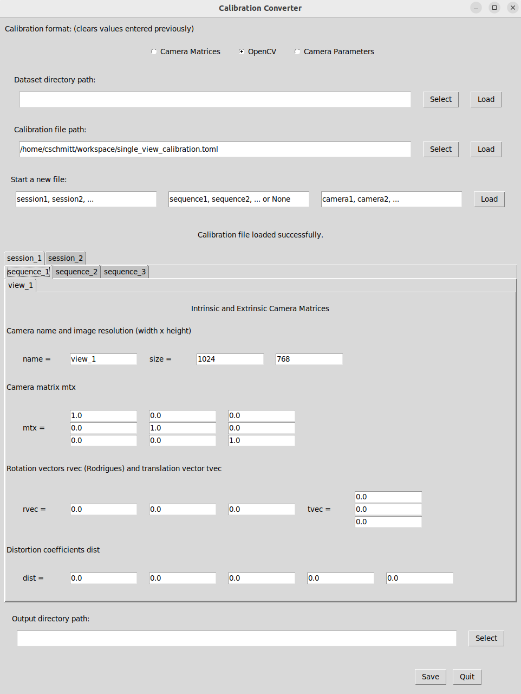

# Include a dataset with a single camera view

This tutorial explains how to run the NICE Toolbox on your own dataset. It covers datasets that contain videos of a single camera, without multi-view captures.

If you are running the NICE Toolbox for the first time, please note that there is quick start guide as well - the [getting started](../getting_started.md) page explains how to run the NICE Toolbox on an example dataset.

```{contents} Contents
:depth: 3
:local:
```

<br>


## 1. Create your config files

Two config files need to be created before running the toolbox:

- `./machine_specific_paths.toml` — machine-level paths (conda). Generate with `make create_machine_specifics`.
- `./nice_project.toml` — project-level paths (datasets, outputs, configs). Generate with `make create_project`.

For more information, see [machine-specific config](../getting_started.md#1-machine-specific-config).

**Placeholders instead of absolute paths:** Note that it is best practice not to use absolute paths in any other files in the NICE Toolbox. Though absolute paths do not cause errors, they hinder collaboration and greatly decrease the readability of code.
Instead, `datasets_folder_path`, `output_folder_path`, and `conda_path` are available in the other config files in `./configs/` as placeholders — use as `<datasets_folder_path>`, `<output_folder_path>`, and `<conda_path>` directly in strings.


## 2. Prepare the dataset

The NICE Toolbox supports datasets with video or image input data, multiple camera views, different number of subjects (1 or 2 currently), as well as various folder structures. These dataset-specific details are defined in `./configs/dataset_properties.toml`. To add a new dataset, first check and potentially adjust the dataset's folder structure, and then update the dataset properties file as described in the following. You can find an example at the end of this section.


### Folder structure

The NICE Toolbox does not require a specific folder layout — every path in the dataset config is user-defined and can use placeholders. In practice most datasets group each recording into its own folder identified by a unique `sequence_id`.

A typical layout looks like:

```
dataset_name/
├── sequence_1/
│   ├── view_1.mp4
├── sequence_2/
│   ├── view_1.mp4
...
└── calibrations.npz
```

If your dataset has an extra nesting level (session/sequence) or one video file per camera per sequence, you can compose the paths in the template accordingly (see the example below).

```{note}
The `calibrations.npz` file does not have to sit in a specific location; its path is declared in `dataset_properties.toml` via `path_to_calibrations`.
```


### Dataset properties

Add the new dataset to `./configs/dataset_properties.toml` as its own top-level block. The block has three parts:

- `sequences = [...]` — the flat list of recordings, each with at least a unique `sequence_id`.
- `[dataset.template]` — optional shared block whose values are merged into every sequence. Put anything the sequences have in common here (subject list, calibrations path, camera set, ...).
- `discover_sequences = "..."` — optional pattern that auto-enumerates sequence folders from disk. Handy for large datasets.

Minimal skeleton:

```toml
[dataset_name]
sequences = [{sequence_id = "recording_a"}]                # one entry per recording, or use `discover_sequences`

[dataset_name.template]
dataset_root = "<datasets_folder_path>/dataset_name"       # user-defined placeholder used below
data_input_folder = "<dataset_root>/<sequence_id>"         # composed per-sequence via `<sequence_id>`
path_to_calibrations = "<dataset_root>/calibrations.npz"   # optional; set to "" if you have no calibration
subjects_descr = ["personL", "personR"]                    # people visible, ordered left to right

[dataset_name.template.video.cameras]                      # named camera tracks
view_1 = {path = "<data_input_folder>/view_1.mp4", sees_subjects = [0, 1]}
```

A few details:
- `sequence_id` must be unique within a dataset. Later, the run file references sequences by this id.
- Every key inside the template block that is *not* a schema field (`dataset_root`, `data_input_folder`, ...) becomes a placeholder that can be referenced by other strings in the same sequence. This lets you compose paths without repeating the root every time.
- `<sequence_id>` inside a template string resolves to *that* sequence's id when the config is loaded.
- Camera and audio tracks live under `template.video.cameras` and `template.audio.tracks`. Each track carries a `sees_subjects` / `hears_subjects` list of subject indices into `subjects_descr` (0-based).
- Detectors reference cameras and tracks by name (via their `camera_names` / `track_names` field) — pick short, stable names.

A comprehensive description of the dataset properties file can also be found on the wiki page on config files under [dataset properties](../wikis/wiki_config_files.md#dataset-properties).


### Example

Assume we have a dataset called "test_dataset" with three video sequences. A single camera records two people sitting next to each other and talking.

Folder structure:

```
test_dataset/
├── sequence_1/
│   └── view_1.mp4
├── sequence_2/
│   └── view_1.mp4
├── sequence_3/
│   └── view_1.mp4
└── calibrations.npz
```

Add to `./configs/dataset_properties.toml`:

```toml
[test_dataset]
sequences = [
    {sequence_id = "sequence_1"},
    {sequence_id = "sequence_2"},
    {sequence_id = "sequence_3"},
]

[test_dataset.template]
dataset_root = "<datasets_folder_path>/test_dataset"
data_input_folder = "<dataset_root>/<sequence_id>"
path_to_calibrations = "<dataset_root>/calibrations.npz"
subjects_descr = ["personL", "personR"]

[test_dataset.template.video.cameras]
view_1 = {path = "<data_input_folder>/view_1.mp4", sees_subjects = [0, 1]}
```

## 3. Create a calibration file

The NICE Toolbox expects a `calibration.npz` file containing the calibration details of the cameras for each dataset. In the single-view case, it can be created by the following two steps:


### Calibration toml file

Create a `single_view_calibration.toml` file that contains the following dictionary for each of your `sequence_id`s:
```toml
[sequence_id.camera_name]                         # enter your sequence_id and camera_name
camera_name = "camera_name"                       # enter the camera_name
image_size = [ <width>, <height> ]            # provide the image resolution (width and height) in pixels
mtx = [ [1.0, 0.0, 0.0], [0.0, 1.0, 0.0], [0.0, 0.0, 1.0] ]
dist = [ 0.0, 0.0, 0.0, 0.0, 0.0 ]
rvec = [ 0.0, 0.0, 0.0 ]
tvec = [ [0.0], [0.0], [0.0] ]
```
Recalling the [example](#example) from the previous section, please find the accompaniing `single_view_calibration.toml` for this example on [keeper](https://keeper.mpdl.mpg.de/d/cdaa6540e0db4a63bbf9/) to download.


### Toml to npz file

Next, use the calibration converter GUI to convert this calibration description into the `calibration.npz` file for the NICE Toolbox.

```bash
# navigate to the NICE toolbox source code folder
cd /path/to/nicetoolbox/

# LINUX: activate the environment 
source ./envs/nicetoolbox/bin/activate

# WINDOWS: activate the environment 
envs\nicetoolbox\Scripts\activate

# run the Calibration Gui
run_calibration_gui
```
The calibration converter offers multiple options to create, load, or change a calibration file for the NICE Toolbox. It outputs the calibration in two files: `calibrations.npz` which is required to run the NICE toolbox and `calibrations.toml` which displays the same calibration data in a human-readable (and changeable) file.

1. On the top, select "OpenCV" as the calibration format.

2. Under "Calibration file path", enter the path to your newly created `single_view_calibration.toml` file or press "Select" to find it on your machine. Press "Load". The data should now show in the converter (click to enlarge):
<style>
img {display: block; margin-left: auto; margin-right: auto;}
</style>
[](../graphics/calibration_converter_1.png)

3. On the bottom, enter the path to your dataset in "Output directory path" or press "Select" to find it on your system. Press "Save" to create the `calibrations.npz` file.

4. When the file(s) have been saved correctly, exit the Calibration Converter by pressing "Quit" in the bottom right corner.


## 4. Define the experiment to run

The main config file to run a specific experiment is `./configs/detectors_run_file.toml`. For the first run of an experiment, there are only a few things to adjust:

```toml
visualize = false               # save image/video visualizations of detectors
...

algorithms = ["hrnetw48", "eth_xgaze", "gaze_fusion", "gaze_distance", "velocity_body", "body_distance"]

[run.dataset_name]              # change 'dataset_name' to your dataset
sequences = [
    {                                    # define which sequence to run on
    sequence_id = "sequence_1",          # match one of the sequence_ids from dataset_properties.toml (supports `*` wildcards)
    video_start = 0,                     # start of the segment (int frame index or timestamp)
    video_length = 100,                  # length of the segment (int frames or timestamp; -1 = full video)
    },
    ...
]

[io]
experiment_name = "<yyyymmdd>"  # optionally, change the name of the experiment, default: date (str)
out_folder = "<output_folder_path>/experiments/<experiment_name>"  # define where to save the experiment output (str)
...
```

Some notes:
- `visualize` enables saving of intermediate results per detector. Disable for a faster run time, enable for test runs of smaller data subsets and debugging.
- `run.dataset_name.sequences` lists the sequences (and time-segments) to process. Extend the list to run multiple sequences; use `sequence_id = "*"` (or a prefix pattern like `"S1_*"`) to match every sequence declared in dataset properties without hand-listing them.
- `io.experiment_name` defaults to the current date (in format YYYYMMDD).
- `io.out_folder` is the experiment output directory. It supports placeholders such as `<output_folder_path>` and `<experiment_name>` that get filled automaticaclly when running the code.
- `video_start` and `video_length` define the video segment to process, accepting either frame numbers (e.g., `0`, `150`) or timestamps (e.g., `00:01:30`, `00:00:45.500`).


A more detailed and complete description of the `./configs/detectors_run_file.toml` file can be found in the wiki page on config files under [run file](../wikis/wiki_config_files.md#run-file).


## 5. Run the toolbox

To run the code, open a terminal or the API of your choice and do:

```bash
cd /path/to/nicetoolbox/
source ./env/bin/activate

run_detectors
```

The outputs will be saved in the folder defined in `./configs/detectors_run_file.toml` under `io.out_folder` (with filled-in placeholders).
To watch the experiment run, check the log file `.../out_folder/nicetoolbox.log`.

<br>

**Congratulations! You got your first experiment running :-)**

<br><br>

The next tutorial on [including a dataset with multiple camera views](tutorial2_dataset_multi_view.md) now adds instructions specific for multiple calibrated cameras.
