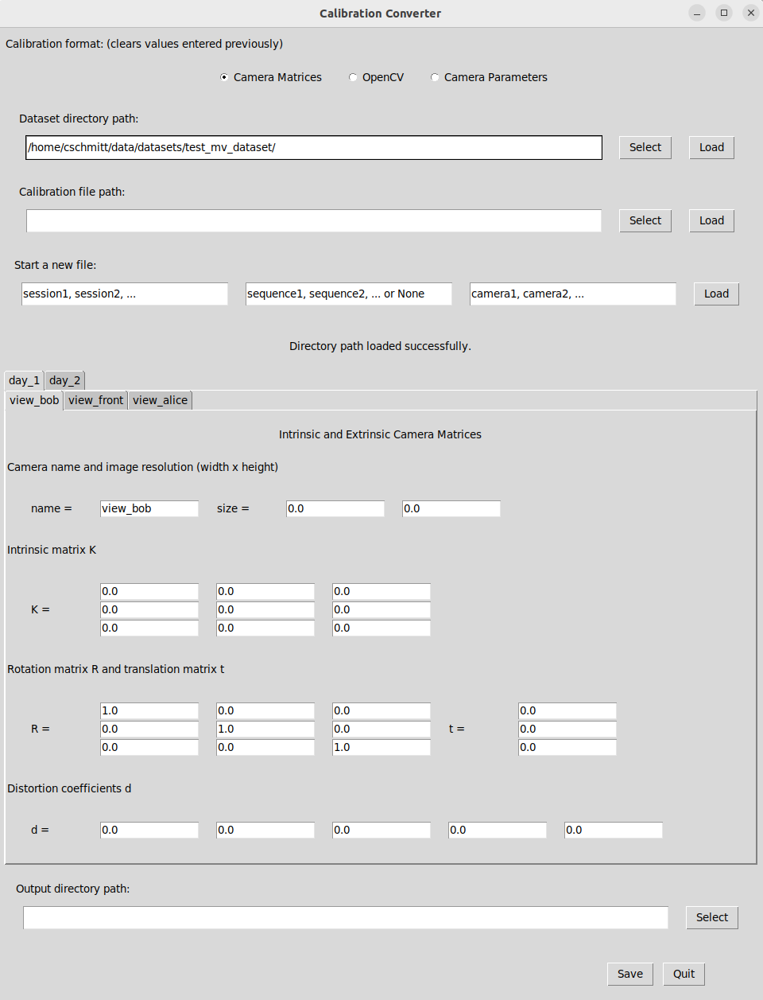
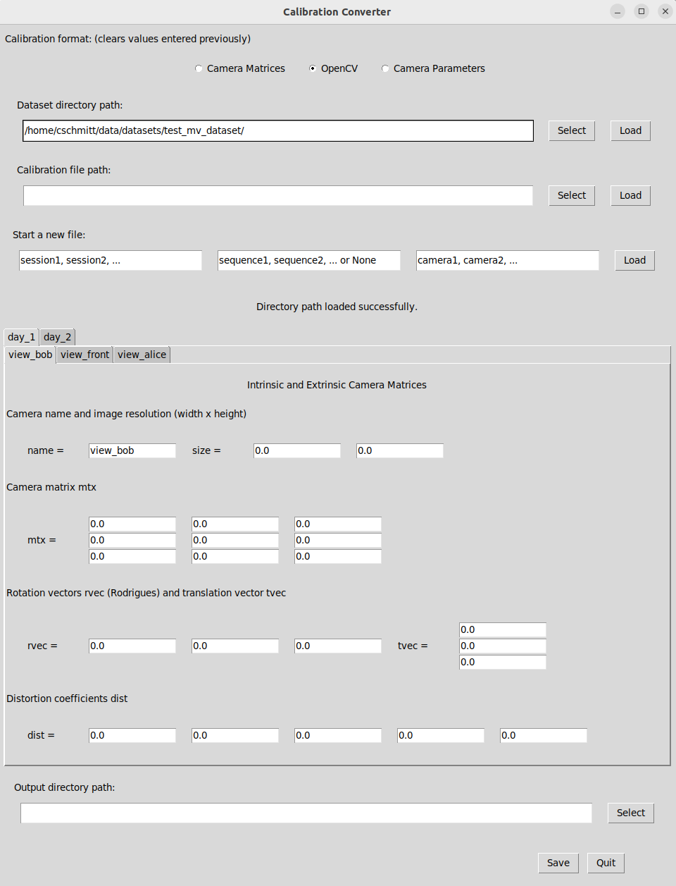

# Include a dataset with multiple camera views

This tutorial extends the previous tutorial on [including a dataset with a single camera view](tutorial1_dataset_single_view.md) to datasets with multiple camera views. As many of the steps are similar, this tutorial focuses on the instructions that are specific for multiple calibrated cameras and refers to the previous tutorial where possible.

Probably, the main difference to the single camera case is that a multi-view capture setup requires time-synchronized and calibrated cameras. While we assume that synchronization and calibration of the cameras have been completed beforehand, we provide a calibration conversion tool for the NICE Toolbox. Instructions can be found in step [3. Create a multi-view calibration file](#3-create-a-multi-view-calibration-file).

<br>

1. [Create your machine-specific config](#1-create-your-machine-specific-config)
2. [Prepare the multi-view dataset](#2-prepare-the-multi-view-dataset)
    - [Update the dataset properties](#2-update-the-dataset-properties)
    - [Example](#example)
3. [Create a multi-view calibration file](#3-create-a-multi-view-calibration-file)
4. [Define the experiments and run the toolbox](#4-define-the-experiments-and-run-the-toolbox)

<br>


## 1. Create your machine-specific config

If you did not create a config file `./machine_specific_paths.toml` yet, follow [these instructions](./tutorial1_dataset_single_view.md#1-create-your-machine-specific-config) to create one.


## 2. Prepare the multi-view dataset

Much of the setup for a multi-view dataset equals the setup for the single-view case. This is the case for **the dataset's expected folder structure**, please find the description [here](./tutorial1_dataset_single_view.md#folder-structure).

A few details to pay attention to arise when creating the dataset properties dictionary, compared to the [single view dataset properties](./tutorial1_dataset_single_view.md#dataset-properties). Therefore, we discuss the dataset properties in the following and also provide another example.


### Update the dataset properties

Overall, the dataset's dictionary defined in the config file `./configs/dataset_properties.toml` has the same keys as described in the previous tutorial in [dataset properties](./tutorial1_dataset_single_view.md#dataset-properties). Some considerations for the multi-view case:

- Map your dataset's cameras and their views of the scene best possible to the descriptions `cam_front`, `cam_top`, `cam_face1`, and `cam_face2`. As some algorithms assume a certain camera view of the scene, this is necessary to find the best cameras to use for each algorithm. Currently, these 4 camera view options are supported.
- `cam_sees_subjects` should now have as many keys as the number of cameras and camera_names that you entered in `cam_front`, `cam_top`, `cam_face1`, and `cam_face2` (at most 4).
- In case your dataset's folder structure includes any folders named like the cameras, e.g., ".../path/to/camera_1/...", use the placeholder `<camera_name>` in the value of your `data_input_folder`.
In case the camera's names are in the filenames, e.g., ".../camera_1.mp4", you do not need the placeholder for the `data_input_folder` as the camera names are not part of the folder path.
- The toolbox expects all cameras to capture at a shared framerate, which is given under key `fps`.


### Example

Assume we have a dataset called "test_mv_dataset" that contains video sequences from 2 capture sessions, no sequences per session, and 3 calibrated cameras. In the scene, two people talk to each other while remaining relatively static (not exchanging places). One camera observes the full scene frontal while each of the other two cameras focuses on one person's face. All cameras capture at a framerate of 25 frames per second and the dataset consists of mp4 video files.

Now suppose the dataset is stored in this folder structure:
```
test_mv_dataset/
├── day_1/
│   ├── view_alice.mp4
│   ├── view_bob.mp4
│   └── view_front.mp4
├── day_2/
│   ├── view_alice.mp4
│   ├── view_bob.mp4
│   └── view_front.mp4
└── calibration.npz
```

To add this dataset to the NICE Toolbox, we need to add the following lines to `./configs/dataset_properties.toml`:

```toml
[test_mv_dataset]                                          # folder name of the dataset
session_IDs = ["day_1", "day_2"]                           # folder names of the sessions
sequence_IDs = []                                          # no sequences
cam_front = 'view_front'                                   # camera with frontal view
cam_top = ''
cam_face1 = 'view_bob'                                     # a camera seeing Bob
cam_face2 = 'view_alice'                                   # a camera seeing Alice
subjects_descr = ["Bob", "Alice"]                          # Alice and Bob are visible in the scene
cam_sees_subjects = {view_front=[0, 1], view_bob=[0], view_alice=[1]}            # one camera sees both people, the others only one each
path_to_calibrations = "<datasets_folder_path>/test_mv_dataset/calibration.npz"  # file path of the calibration file
data_input_folder = "<datasets_folder_path>/test_mv_dataset/<cur_session_ID>"        # file path of the video files
start_frame_index = 0                                      # given video files, enter the default 0
fps = 25                                                   # all cameras capture 25 frames per second
```


## 3. Create a multi-view calibration file

We assume that the cameras are time-synchronized and calibrated intrinsically and extrinsically.
To create the `calibration.npz` file that the NICE Toolbox understands, we recommend using our calibration converter GUI.
It can process calibration parameters from two formats:
- **Camera Matrices:** This format stores intrinsic calibration parameters in a 3x3 "intrinsic matrix K" and extrinsic parameters in a 3x3 "rotation matrix R" and a 3 dimensional "translation vector t". Distortion coefficients (k1, k2, p1, p2, k3) are saved in a 5 dimensional vector "d".
- **OpenCV:** The format that OpenCV's camera calibration routines output. The intrinsic or camera parameters are stored in a 3x3 matrix "mtx" and the extrinsic parameters are given as a 3 dimensional Rodrigues rotation vectors "rvec" and a 3 dimensional translation vectors "tvec". Again, distortion coefficients (k1, k2, p1, p2, k3) are saved in a 5 dimensional vector "dist".


Start the calibration converter GUI from command line / terminal using
```bash
# navigate to the NICE toolbox source code folder
cd /path/to/nicetoolbox/

# LINUX: activate the environment 
source ./envs/nicetoolbox/bin/activate

# WINDOWS: activate the environment 
envs\nicetoolbox\Scripts\activate

# run the Calibration Gui
run_calibration_gui
```

The calibration converter offers multiple options to create, load, or change a calibration file for the NICE Toolbox. Here, we show how to create a new file from scratch, given the dataset's directory path.

1. On the top, select "Camera Matrices" or "OpenCV" as the calibration format, depending on your calibration data.
2. To create a new file from your dataset's directory path, enter the absolute path to the dataset under "Dataset directory path" or press "Select" to find it on your machine. Press "Load". The GUI will now show the folder structure of your data directory with default values for all calibration parameters (click to enlarge):
[](../graphics/tutorial2_calibration_converter_1.png)
[](../graphics/tutorial2_calibration_converter_2.png)

3. Enter your calibration data into the provided fields for each camera. Note: In the case of many cameras, sessions, or sequences, this can be tedious. Check out the next tutorial on [calibration conversion](tutorial3_calibration_conversion.md) to find an alternative option for directly loading calibration data into the GUI.
4. When all data is entered, provide a path to save the calibration file (likely, your dataset's directory path) under "Output directory path" on the bottom of the GUI window. Press "Save". The converter saves two files: `calibrations.npz` which is required to run the NICE toolbox and `calibrations.toml` which displays the same calibration data in a human-readable (and changeable) file. Both files can be loaded to the Converter again if adjustments need to be made.
5. When the file(s) have been saved correctly, exit the Calibration Converter by pressing "Quit" in the bottom right corner.


## 4. Define the experiments and run the toolbox

Please follow the instructions in [define the experiment to run](./tutorial1_dataset_single_view.md#4-define-the-experiment-to-run) to create your experiments and in [run the toolbox](tutorial1_dataset_single_view.md#5-run-the-toolbox) for starting the experiment. It will now use all cameras provided and specified in the [dataset_properties](#2-update-the-dataset-properties). Check the log-file `.../out_folder/nicetoolbox.log` to see it working.
