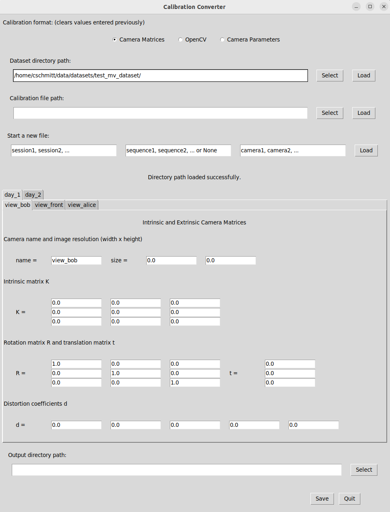
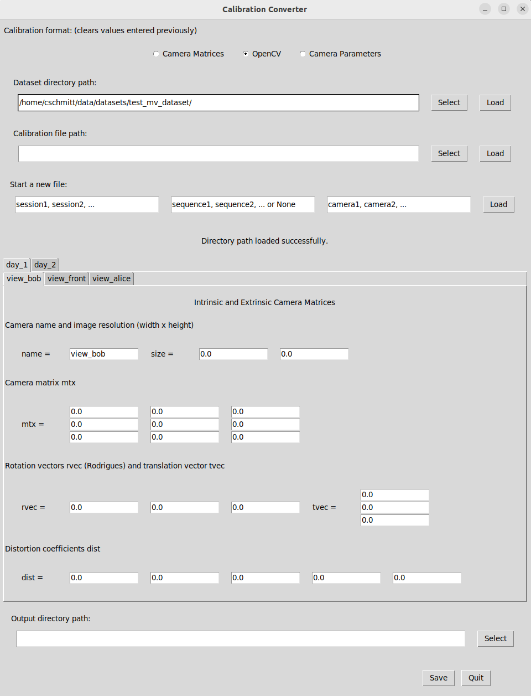

# Include a dataset with multiple camera views

This tutorial extends the previous tutorial on [including a dataset with a single camera view](tutorial1_dataset_single_view.md) to datasets with multiple camera views. As many of the steps are similar, this tutorial focuses on the instructions that are specific for multiple calibrated cameras and refers to the previous tutorial where possible.

Probably, the main difference to the single camera case is that a multi-view capture setup requires time-synchronized and calibrated cameras. While we assume that synchronization and calibration of the cameras have been completed beforehand, we provide a calibration conversion tool for the NICE Toolbox. Instructions can be found in step [3. Create a multi-view calibration file](#3-create-a-multi-view-calibration-file).

```{contents} Contents
:depth: 3
```


## 1. Create your config files

If you did not create `./machine_specific_paths.toml` and `./nice_project.toml` yet, follow [these instructions](./tutorial1_dataset_single_view.md#1-create-your-config-files) to create them.


## 2. Prepare the multi-view dataset

Much of the setup for a multi-view dataset equals the setup for the single-view case. This is the case for **the dataset's expected folder structure**, please find the description [here](./tutorial1_dataset_single_view.md#folder-structure).

A few details to pay attention to arise when creating the dataset properties dictionary, compared to the [single view dataset properties](./tutorial1_dataset_single_view.md#dataset-properties). Therefore, we discuss the dataset properties in the following and also provide another example.


### Update the dataset properties

The multi-view case uses the same dataset config shape as the single-view case (see [dataset properties](./tutorial1_dataset_single_view.md#dataset-properties)) — you just declare more cameras under `template.video.cameras`. A few things to keep in mind:

- Each camera has a **user-chosen name** (e.g. `view_front`, `view_bob`). That name is what detectors reference in their `camera_names` field, and what the visualizer uses as a canvas id.
- `sees_subjects` per camera lists the subjects that camera observes, as indices into `subjects_descr` (0-based). A camera that sees only one subject gets a one-element list.
- Detectors can bind to a subset of cameras by name (`camera_names = ["view_bob", "view_alice"]`), or bind to all available cameras via `camera_names = "*"`.
- The toolbox assumes all cameras of a sequence share one framerate, resolved from the video files themselves.


### Example

Assume we have a dataset called "test_mv_dataset" containing recordings from 2 capture days with 3 calibrated cameras each. Two people talk to each other; one camera observes the full scene frontally while the other two focus on one person's face each. All cameras capture at 25 fps.

Folder structure:
```
test_mv_dataset/
├── day_1/
│   ├── view_alice.mp4
│   ├── view_bob.mp4
│   └── view_front.mp4
├── day_2/
│   ├── view_alice.mp4
│   ├── view_bob.mp4
│   └── view_front.mp4
└── calibrations.npz
```

Add to `./configs/dataset_properties.toml`:

```toml
[test_mv_dataset]
sequences = [
    {sequence_id = "day_1"},
    {sequence_id = "day_2"},
]

[test_mv_dataset.template]
dataset_root = "<datasets_folder_path>/test_mv_dataset"
data_input_folder = "<dataset_root>/<sequence_id>"
path_to_calibrations = "<dataset_root>/calibrations.npz"
subjects_descr = ["Bob", "Alice"]

[test_mv_dataset.template.video.cameras]
view_front = {path = "<data_input_folder>/view_front.mp4", sees_subjects = [0, 1]}
view_bob   = {path = "<data_input_folder>/view_bob.mp4",   sees_subjects = [0]}
view_alice = {path = "<data_input_folder>/view_alice.mp4", sees_subjects = [1]}
```

Each folder inside `test_mv_dataset/` is treated as one sequence; the template composes the path to each camera file via `<data_input_folder>` and `<sequence_id>`.


## 3. Create a multi-view calibration file

We assume that the cameras are time-synchronized and calibrated intrinsically and extrinsically.
To create the `calibration.npz` file that the NICE Toolbox understands, we recommend using our calibration converter GUI.
It can process calibration parameters from two formats:
- **Camera Matrices:** This format stores intrinsic calibration parameters in a 3x3 "intrinsic matrix K" and extrinsic parameters in a 3x3 "rotation matrix R" and a 3 dimensional "translation vector t". Distortion coefficients (k1, k2, p1, p2, k3) are saved in a 5 dimensional vector "d".
- **OpenCV:** The format that OpenCV's camera calibration routines output. The intrinsic or camera parameters are stored in a 3x3 matrix "mtx" and the extrinsic parameters are given as a 3 dimensional Rodrigues rotation vectors "rvec" and a 3 dimensional translation vectors "tvec". Again, distortion coefficients (k1, k2, p1, p2, k3) are saved in a 5 dimensional vector "dist".


Start the calibration converter GUI from command line / terminal using
```bash
# navigate to the NICE toolbox source code folder
cd /path/to/nicetoolbox/

# LINUX: activate the environment 
source ./envs/nicetoolbox/bin/activate

# WINDOWS: activate the environment 
envs\nicetoolbox\Scripts\activate

# run the Calibration Gui
run_calibration_gui
```

The calibration converter offers multiple options to create, load, or change a calibration file for the NICE Toolbox. Here, we show how to create a new file from scratch, given the dataset's directory path.

1. On the top, select "Camera Matrices" or "OpenCV" as the calibration format, depending on your calibration data.
2. To create a new file from your dataset's directory path, enter the absolute path to the dataset under "Dataset directory path" or press "Select" to find it on your machine. Press "Load". The GUI will now show the folder structure of your data directory with default values for all calibration parameters (click to enlarge):
[](../graphics/tutorial2_calibration_converter_1.png)
[](../graphics/tutorial2_calibration_converter_2.png)

3. Enter your calibration data into the provided fields for each camera. Note: In the case of many cameras, sessions, or sequences, this can be tedious. Check out the next tutorial on [calibration conversion](tutorial3_calibration_conversion.md) to find an alternative option for directly loading calibration data into the GUI.
4. When all data is entered, provide a path to save the calibration file (likely, your dataset's directory path) under "Output directory path" on the bottom of the GUI window. Press "Save". The converter saves two files: `calibrations.npz` which is required to run the NICE toolbox and `calibrations.toml` which displays the same calibration data in a human-readable (and changeable) file. Both files can be loaded to the Converter again if adjustments need to be made.
5. When the file(s) have been saved correctly, exit the Calibration Converter by pressing "Quit" in the bottom right corner.


## 4. Define the experiments and run the toolbox

Please follow the instructions in [define the experiment to run](./tutorial1_dataset_single_view.md#4-define-the-experiment-to-run) to create your experiments and in [run the toolbox](tutorial1_dataset_single_view.md#5-run-the-toolbox) for starting the experiment. It will now use all cameras provided and specified in the [dataset_properties](#2-update-the-dataset-properties). Check the log-file `.../out_folder/nicetoolbox.log` to see it working.
