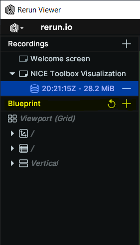
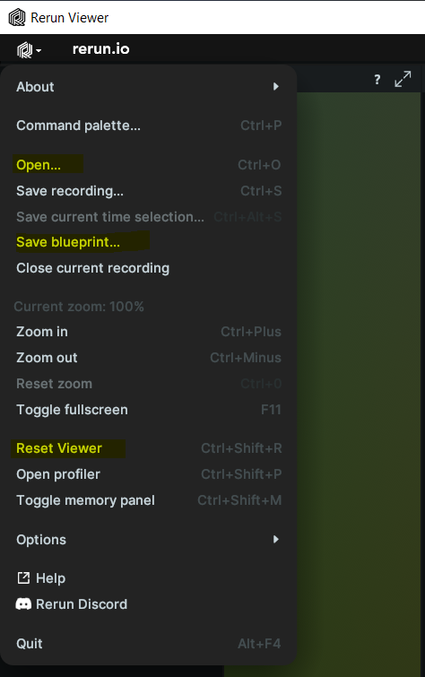

# Visualizations in rerun

This tutorial explains how to use [rerun](rerun.io) for an interactive visualization of the results and preditions by the NICE Toolbox.


- [Starting rerun](#starting-rerun)
- [Visualizer config](#visualizer-config)
- [Configuring component data display in rerun windows](#configuring-component-data-display-in-rerun-windows)
    - [Configuring algorithm display](#configuring-algorithm-display)
    - [Configuring appearance](#configuring-appearance)
- [Configuring rerun viewer and blueprint in rerun](#configuring-rerun-viewer-and-blueprint-in-rerun)

<br>


## Starting rerun

Open a command line or terminal and navigate to the top level directory of the nicetoolbox repository. Simply start the visualizer by running
```bash
source ./env/bin/activate
python visual/media/main.py
```

It will open a window like this one:


## Visualizer config

The visualizer config `./visual/configs/visualizer_config.toml` consists of three main part io, media, and component specifications.

```toml
[io]
dataset_folder = "<datasets_folder_path>"                                 # main dataset folder
nice_tool_input_folder = "<output_folder_path>/raw_processed/isa_tool_input/<dataset_name>_<session_ID>_<sequence_ID>" # raw_processed input data
experiment_folder = "<output_folder_path>/experiments/20240906_mm"        # NICE Toolbox experiment output
experiment_video_folder = "<experiment_folder>/<video_name>"              # NICE Toolbox output folder for the specific video.
experiment_video_component = "<experiment_video_folder>/<component_name>" # NICE Toolbox output folder for the specific component

[media]                                # each Media session shows one video results.
dataset_name = 'mpi_inf_3dhp'          # dataset of the video
video_name = 'mpi_inf_3dhp_S1_s20_l20' # name of video result folder
multi_view = true                      # true if you have multiple cameras, otherwise set it to false
[media.visualize]                      # specify what will be visualized
components = [..]                     # list of components
camera_position = true                 # true if you want to visuailize camera position -- requires extrinsic information of the camera
start_frame = 0                        # starting frame for the visualization
end_frame = -1                         # end frame for the visualization, -1 means process until the end of the video
visualize_interval = 1                 # 1 means visualize every frame; change the parameter accordingly if you want to visualize every x frames
```

A detailed description of visualizer configuration can be found in the wiki page on config files under [visualizer config](../wikis/wiki_config_files.md#visualizer-config).


## Configuring component data display in rerun windows

You can control which data will be shown in specific rerun windows by adjusting the 'media.component.canvas' items
The keys (like '3d' or '2d_interpolated') represent different type of data provided by that component.
The value lists define which canvases (rerun windows) will show the data
1. '3D_Canvas': This shows data in the 3D canvas. It is only for multi-view datasets. (Do not change the canvas name).
2. Cameras: Data will be visualized on that specific camera image. The camera name must match the camera placeholder names in dataset_properties.toml
3. Metrics - The displays the data as plots.
4. Empty list: If you don't want the data to be visualized, leave the list empty.


### Configuring algorithm display

Under 'media.component', the algorithms parameter let you choose which algorithms to display.
For example, if you have multiple algorithms (e.g., hrnetw48 and vitpose in the body_joints component),
you can specify which algorithm’s results to show.
If you want to see results from both algorithms, list both names.


### Configuring appearance

Under 'media.component.appearance', you can configure the color and radii (the size of the dots and lines).

```toml
# Component: gaze individual - An example for 3D_Canvas and Camera Canvases
[media.gaze_individual]
algorithms = ['xgaze_3cams']            # list of algorithms
[media.gaze_individual.canvas]
3d_filtered = ["3D_Canvas", "<cam_face1>", "<cam_face2>", "<cam_top>", "<cam_front>"] ## key options 3d, 3d_filtered ## value options: [3D_Canvas], [3D_Canvas, camera names], [camera names], []
                                                                                      ## Note: Delete '3D_Canvas' if you don't have a multi-view setup.
[media.gaze_individual.appearance]
colors = [[0,150, 90]]                  # define the color of individual gaze
radii = {'3d'= 0.01, 'camera_view'= 4}  # define the size of gaze arrow in 3D_Canvas and camera views

# Component: kinematics  - An example for Metrics Display
[media.kinematics]
algorithms = ['velocity_body']

[media.kinematics.canvas]
velocity_body_3d = ["metric_velocity"] # if don't have multi-view, use velocity_body_2d
#velocity_body_2d = ["metric_velocity"]

[media.kinematics.joints]              # visualize the mean velocity for the given bodyparts.
"head" = ["nose","left_eye","right_eye","left_ear","right_ear"]
"upper_body" = ["left_shoulder","right_shoulder","left_elbow", "right_elbow", "left_wrist", "right_wrist"]  # Indices of keypoints belonging to the upper body
"lower_body" = ["left_hip", "right_hip", "left_knee", "right_knee", "left_ankle", "right_ankle"]

```


## Configuring rerun viewer and blueprint in rerun
When Rerun is initiated, it automatically creates a heuristic view for the windows.
You can manually change this by dragging the windows or adding new ones using the plus sign next to the Blueprint menu.



This Blueprint can be saved using the 'Save blueprint...' menu option and reopened later using the
'Open' option. Once you configure the Rerun viewer, it will use the same blueprint for future sessions.
You can reset the layout by clicking 'Reset Blueprint.'



If your new video does not have certain windows that the old dataset had, unused empty windows may appear.
To get a fresh heuristic layout, reset the blueprint.
