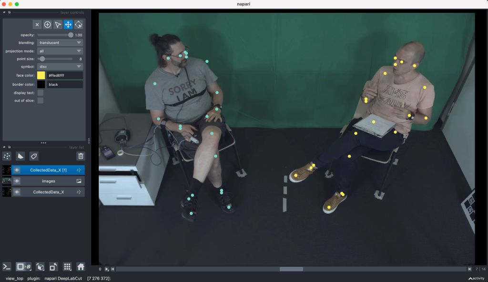
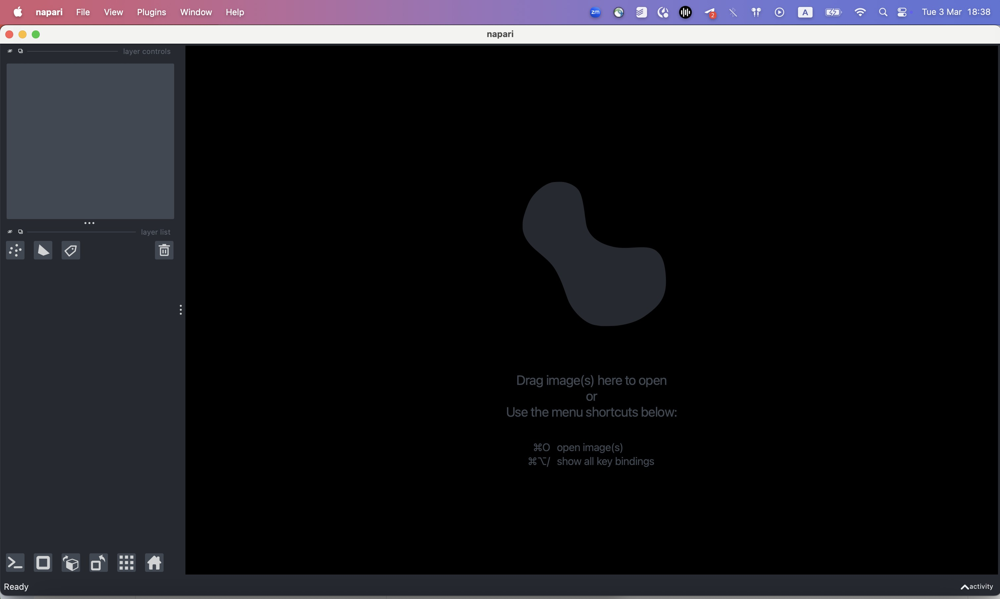
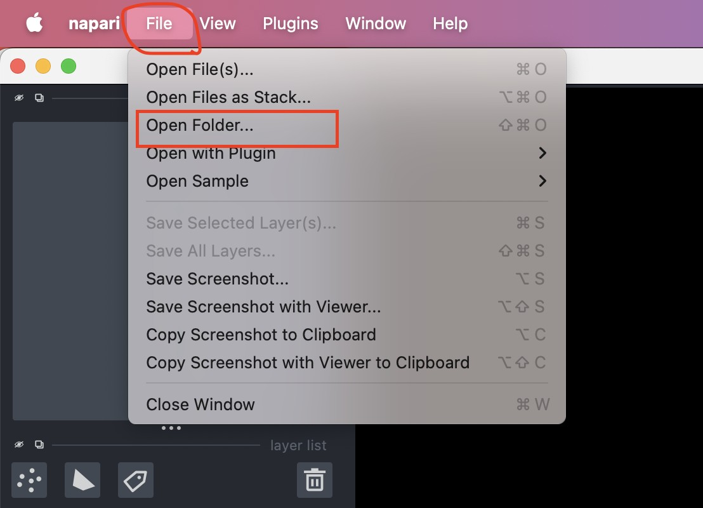
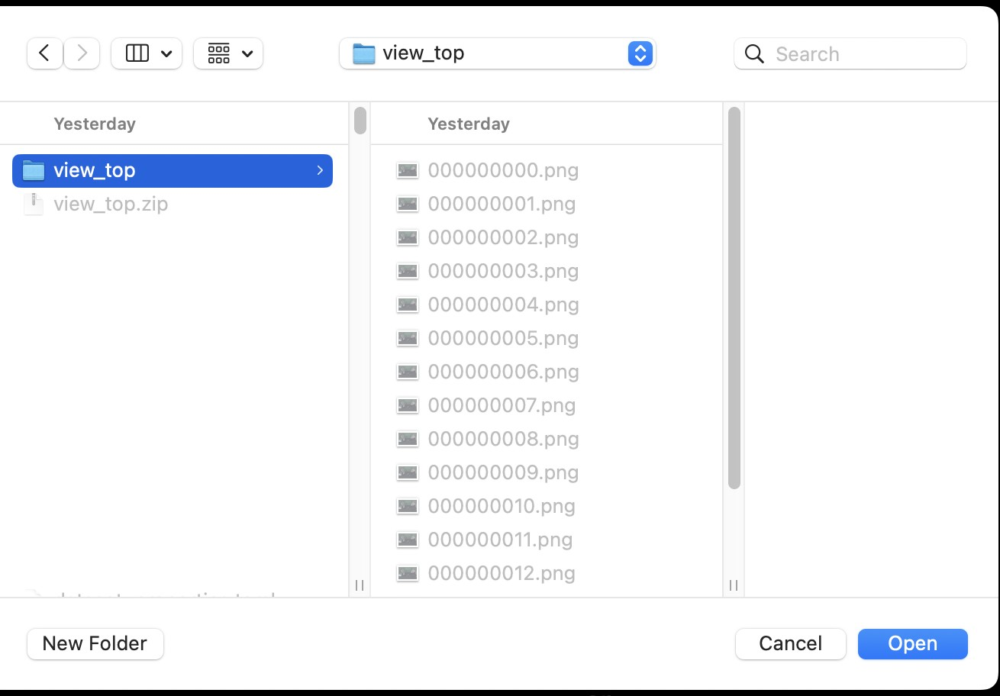
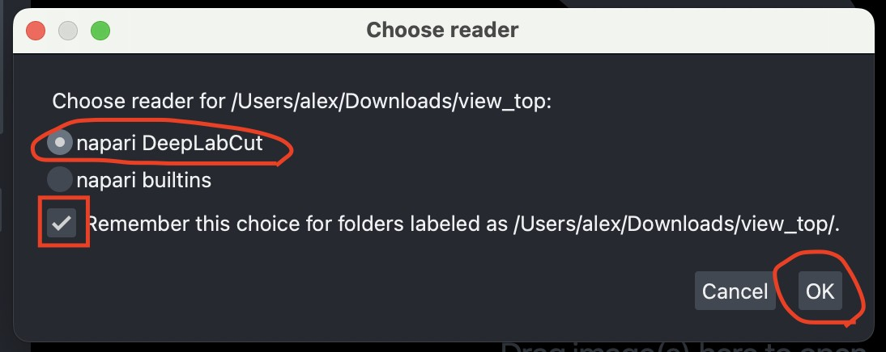
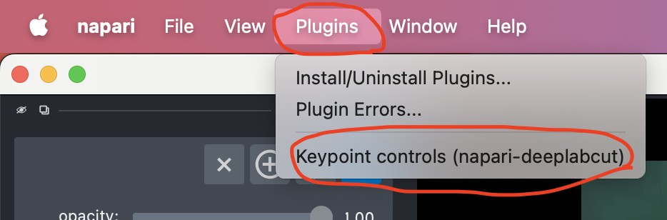
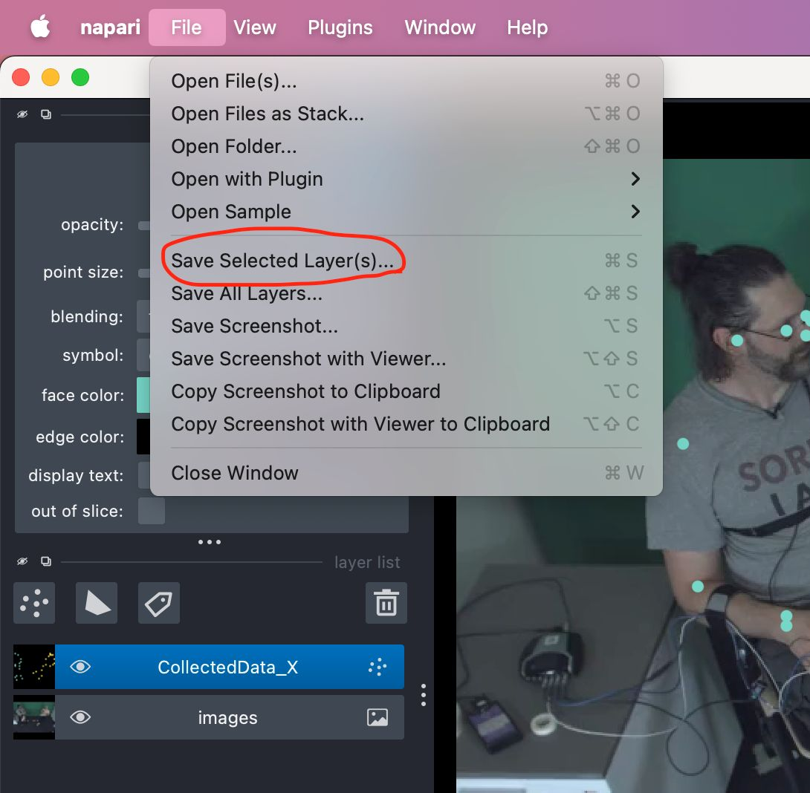

# Napari-DeepLabCut Connector: Export and Import Body Joints

This tutorial shows how to export NICE Toolbox body joint detections to [napari-DeepLabCut](https://github.com/DeepLabCut/napari-deeplabcut), manually correct hand, and import the corrected annotations back into the toolbox as ground truth for evaluation. For the full set of tasks and config options, see the [Connectors wiki](../wikis/wiki_connectors.md).

```{contents} Contents
:depth: 3
:local:
```


## 1. What is napari-DeepLabCut?



[napari](https://napari.org) is an open-source image viewer for scientific data. [napari-DeepLabCut](https://github.com/DeepLabCut/napari-deeplabcut) is a plugin that turns it into a keypoint annotation tool: it displays video frames with body joints drawn on top, and lets you drag individual keypoints to their correct positions.

Correcting detections by hand is much faster than labeling from scratch: the detector places every joint, and you only move the ones it got wrong. This produces frame-accurate ground truth for measuring body joint detector accuracy.

The connector works in both directions:

| Task | Direction | What it does |
|------|-----------|--------------|
| `export_body_joints` | Toolbox → napari | Writes detections and their video frames as a napari project |
| `import_body_joints` | napari → Toolbox | Reads corrected annotations back into a `body_joints.npz` |


## 2. Prerequisites

- **napari with the napari-DeepLabCut plugin** installed (see below).
- **A completed detector run** producing `body_joints` output (see [Tutorial 1](tutorial1_dataset_single_view.md)).

The connector itself requires no additional installation — it is part of the standard NICE Toolbox environment.

Install napari-DeepLabCut in its own virtual environment, separate from the NICE Toolbox environment, by following the instructions in the [napari-deeplabcut repository](https://github.com/DeepLabCut/napari-deeplabcut).

Once installed, start it from a terminal with:

```bash
napari
```

If the installation was successful, the napari window opens shortly after.

## 3. Export to napari

The export task takes a `body_joints.npz` from a detector run and writes a napari project: one folder per camera, each containing the annotation file and a copy of the video frames it refers to.

A template config is provided at `configs/connectors/napari_export_body_joints.toml`:

```toml
npz_key = "2d"   # which array to read from the body_joints NPZ

[run.vitpose_huge]
dataset_sequence = "communication_multiview_sequence_xyz"
subsequence_name = "<dataset_sequence>_s0_l-1"
input         = "<experiment>/<subsequence_name>/body_joints/vitpose_huge.npz"
frames_folder = "<output_folder_path>/nicetoolbox_input/<dataset_sequence>"
cameras       = ["view_center", "view_top"]   # "*" for all cameras
output        = "<napari_output>/vitpose_huge"
```

| Field | Description |
|-------|-------------|
| `npz_key` | Array to read from the NPZ, e.g. `2d` or `2d_filtered` |
| `input` | Path to the detector's `body_joints` NPZ |
| `frames_folder` | Pre-processed frames from the detector run, laid out as `<camera>/frames/<frame>.png` |
| `cameras` | Toolbox camera names to export, or `"*"` for all available |
| `output` | Folder to which output napari-project |

### Sliding window

Labeling thousands of frames by hand is impractical. The optional `[window]` table exports only a sample: it keeps `size` consecutive frames, then jumps `stride` forward, repeating to the end of the sequence.

```toml
[window]
size   = 5    # frames per window
stride = 30   # distance between window starts
```

Over a 150-frame sequence this exports frames 0–4, 30–34... — 5 segments in total. Keeping short *continuous* clips rather than isolated frames means motion is still visible around each one, which makes joints easier to place correctly.

Windows may not overlap, so `stride` must be bigger than `size`. Setting them equal exports every frame in contiguous blocks. Remove the table entirely to export everything.

### Run the export

```{warning}
Re-running the export deletes previously exported folders. Any manual corrections stored there will be lost, so back up your work before exporting again.
```

To run the export, type this command in the terminal:

```bash
napari_connector export_body_joints
```

This produces one folder per camera, each holding the annotation file and its frames:

```
vitpose_huge/
  view_center/
    CollectedData_NICEToolbox.h5
    000000000.png
    000000001.png
    ...
  view_top/
    CollectedData_NICEToolbox.h5
    ...
```

## 4. Load the data in napari

Start napari. It opens an empty window:



In the top left menu click **File → Open Folder**:



Navigate to a single **camera folder** and click **Open**.



A small dialog appears asking which reader to use. Make sure **napari DeepLabCut** is selected, tick **Remember this choice**, and click **OK**:



Napari loads all frames with their body joints drawn on top:


In the top left menu click **Plugins → Keypoint controls (napari-deeplabcut)**:



To learn more about how to use napari-deeplabcut and its controls, check [official documentation](https://deeplabcut.github.io/DeepLabCut/docs/gui/napari/basic_usage.html) or [video tutorials](https://www.youtube.com/watch?v=hsA9IB5r73E).

When you have finished editing, save your work by clicking **File → Save Selected Layers**.



The corrected annotations are written back to the same `CollectedData_NICEToolbox.h5` file in the camera folder. Repeat the process for each camera folder.

## 5. Import annotations to NICE Toolbox

The import task reads a folder of per-camera annotations and merges them into a single multi-camera `body_joints.npz`.

A template config is provided at `configs/connectors/napari_import_body_joints.toml`:

```toml
[run.sequence_xyz]
input        = "<annotation_folder>/body_joints_napari"
output       = "<napari_output>/sequence_xyz_body_joints.npz"
start        = 0        # from first frame
end          = -1       # until the end
fps          = 30       # frame rate of the annotated video
reset_frames = false    # keep the original frame numbers
```

| Field | Description |
|-------|-------------|
| `input` | Root folder of the napari project, holding one subfolder per camera |
| `output` | Where to save the output `body_joints.npz` |
| `start` / `end` | Frame window to extract, as a frame index or `"HH:MM:SS"` |
| `fps` | Frame rate of the annotated video |
| `reset_frames` | If `true`, output frames reset indexing from `000000000`; if `false`, they keep the source frame numbers |


### Camera and subject mapping

If your folder or individual names differ from your toolbox names, map them with the optional `[cameras]` and `[subjects]` tables:

```toml
[subjects]
pL = "person_left"
pR = "person_right"

[cameras]
cam3 = "view_top"
```

### Run the import

To import napari data to NICE Toolbox format, type:

```bash
napari_connector import_body_joints
```

The result will be a single `body_joints.npz` per sequence, covering every camera together.


### Use the result for evaluation

To use the annotations as ground truth, copy the NPZ into your dataset's annotations folder, named after the sequence and component:

```
<datasets_folder_path>/communication_multiview/annotations/sequence_xyz_body_joints.npz
```

Declare annotations results in `dataset_properties.toml` config:

```toml
# ======== Dataset definition ========
[communication_multiview]
sequences = [ {sequence_id = "sequence_xyz"} ]

...
# ======== Evaluation configuration ========
[communication_multiview.template.annotation]
annotations_folder = "<dataset_root>/annotations"
# labels for different components
[communication_multiview.template.annotation.components]
body_joints = {path = "<annotations_folder>/<sequence_id>_body_joints.npz"}

```

Then declare a metric with `source = "annotation"` in `configs/evaluation_config.toml`:

```toml
[metrics."body_pck@10px"]
metric_type  = "pck"
threshold    = 10   # in pixels
predictions  = { component = "body_joints", npz_key = "2d" }
ground_truth = { source = "annotation", component = "body_joints", npz_key = "2d" }
summary_group_by = ["label"]        # one row per joint name
```

See [Tutorial 5](tutorial5_evaluation.md) for a full walkthrough of the evaluation pipeline. For practical guidance on joint definitions, occlusions, and general recommendations, [see this document here](../wikis/wiki_body_joints_labeling.md).

