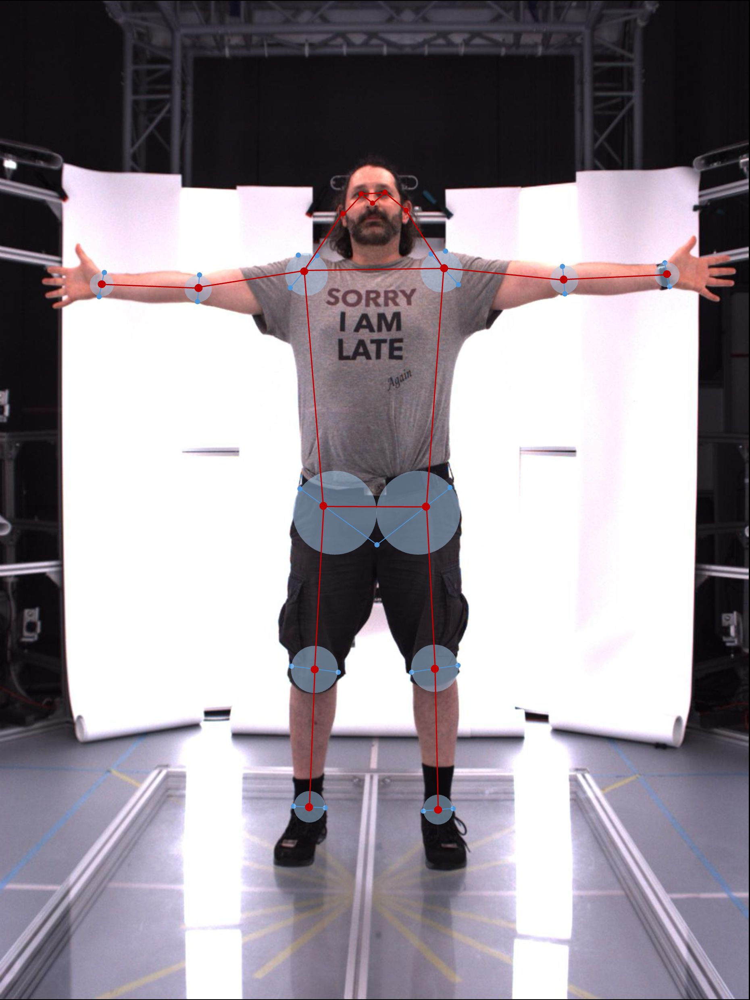
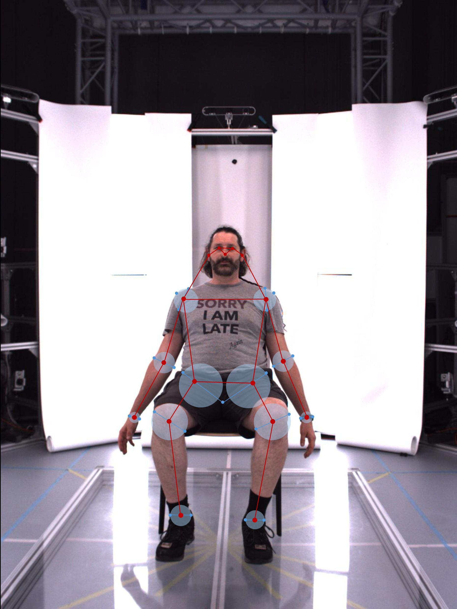

# How to manually label body joints

NICE Toolbox labels body joints automatically and derives useful measures from them (e.g. kinematics or velocity). But how do you know the results are correct, and that the system is calibrated for your own recordings? Published benchmarks are the traditional answer, yet tracking quality varies considerably with the particular setting (camera placement, lighting, clothing, occlusion and the kind of movement being recorded). A model that performs well on a benchmark may perform poorly on your data.

The most reliable way to find out is to label a sample of frames by hand and measure the algorithm against them. Unfortunately, there is not much publicly available information about how to manually label body joints. Most computer vision papers do not publish details about how the labeling process was organized, nor a manual comprehensive enough to replicate it. In contrast, existing guides on manually placing external markers for joint location using anatomical landmarks are too precise to apply to two-dimensional video data of people wearing everyday clothing. Nonetheless, we would like to offer some practical advice on labeling body joints efficiently. Based on biomechanical joint definitions, we established labeling heuristics to approximate and simplify joint location.

For the mechanics of getting frames into an annotation tool and the results back into the toolbox, see [Tutorial 7](../tutorials/tutorial7_napari_deeplabcut_connector.md).

```{contents} Contents
:depth: 3
:local:
```


## Understanding models and metrics limitation

Before correcting anything, it is worth knowing what your corrections can and cannot achieve.

A pose estimation model reproduces the convention it was trained on, and that convention is a common sense notion of where a joint appears, annotated by people looking at photographs — not a biomechanical centre of rotation.

That offset is a property of the model, not a mistake in a particular frame. Relabeling every hip to its true anatomical centre does not make the detector better. It makes your ground truth disagree with the model everywhere, and the resulting metric measures the difference between two conventions rather than the model's accuracy. **Correct against the convention the model was trained on**, and treat the biomechanical definitions as a way to be *consistent*, not as a target to force the model towards.

**Threshold metrics collapse everything inside their radius.** The PCK metric counts a joint as correct when it falls within a fixed pixel distance of the ground truth:

```toml
[metrics."body_pck@10px"]   # strict
threshold = 10  # px threshold

[metrics."body_pck@25px"]   # loose
threshold = 25  # px threshold
```

At a 25 px threshold, a prediction 3 px from your correction and one 20 px away score identically — both are simply correct. Any adjustment smaller than the threshold changes nothing in the result. Nudging a point a few pixels towards its ideal position is therefore effort that cannot show up in the metric, while still costing labeling time and adding day-to-day inconsistency.

So let your precision target set the effort:

- **Fix what crosses the threshold.** Points outside their estimated region, points in the wrong anatomical order, gross misplacements and swapped identities. These change the score.
- **Leave what sits comfortably inside it.** If your evaluation runs at 25 px, do not spend time on 5 px refinements.

Metrics that report raw distance rather than a threshold, such as `distance_error`, are sensitive to small corrections. Match your labeling precision to the metric you actually intend to report. See [Evaluation metrics](wiki_evaluation_metrics.md) for the full list.


## What a key point means

NICE Toolbox supports many skeleton definitions (e.g. `mpii`, `human36m`, `sam_3d_body_mhr`), but for this page we will focus on [COCO](https://cocodataset.org/#home). This convention defines key points for eyes, nose and ears, for shoulders, elbows and wrists, and for hips, knees and ankles.

A body joint key point marks the **skeletal joint**, placed as close as possible to its centre of rotation, not the surface of the skin. Treat the joint as if seen through **x-ray**: what you are marking is inside the body, and clothing or flesh in front of it does not move the point. The table below provides simplified definitions of joint centres. As the focus lies on estimation regions rather than precise corrections, exact definitions are not required for labeling.

**Simplified definitions of body joint centres**

| Joint type | Body joints | Where the centre is |
|------------|-------------|---------------------|
| Ball-and-socket | shoulders, hips | Centre of the ball/head of the joint |
| Hinge | elbows, knees, ankles | Centre of the convex part of the joint |
| Condyloid | wrists | Centre of the head of the joint |

In contrast to body joints, facial key points are surface features and are placed directly: the centre of each eye, the tip of the nose, and the centre of each ear.


## Estimating the joint centre using heuristics

Since skeletal joints inside the body are not visible from the outside, we rely on external indicators for their location. Joints are positioned in the part of the limb that **bends** when flexed or rotated — often visible as creasing or folding of skin and clothes, or as a protruding bone. For labeling, each body joint is approximated with a circular region and the key point placed in its middle:

- **Elbows, wrists, knees, ankles.** The circle's diameter is the width of the joint, measured between the two contour points on either side. The ideal position is the midpoint between them.
- **Shoulders.** The circle is derived from three contour points: the armpit, the point of highest curvature at the edge of the shoulder, and the top of the shoulder directly opposite the armpit. The joint centre lies midway between the armpit and the top.
- **Hips.** Each hip is located at about two-thirds of the way between the crotch and the corresponding hip bone. The estimation circle is roughly the width of one leg.

These heuristics should be viewed as an orientation for joint location rather than strict rules. They should be adapted to the position, perspective, body composition, and clothing of the individuals in the labeled video. When considering perspective changes, think of them as spheres around the joint. The body contour always serves as the border for labeling key points, even if an estimation circle surpasses it.



*Visualization of joint centre heuristics and estimation circles for frontal standing position.*



*Visualization of joint centre heuristics and estimation circles for frontal sitting position.*


## Correcting existing key points

The detector has already placed every key point, so most of the work is deciding whether a point is *good enough* rather than positioning it from scratch.

- **A key point that is inside its estimated region and lies within the contours of the body is left alone.** Do not nudge points that are already acceptable — consistency of small corrections does not matter, and needless movement only adds noise.
- **A key point outside its region and/or the body contour is moved inside**, ideally to the estimated centre.
- **Key points in the wrong anatomical order are corrected**, even when both are inside their regions. For example, if the wrist and elbow are each within their own region but the wrist sits on the wrong side of the elbow, the pair does not follow the skeletal structure and must be fixed.

The acceptable region is smaller for facial key points and larger for body joints, and larger again for joints you are inherently less certain about, such as hips and occlusions. Perspective, clothing, and body composition may change the size of estimation circles as well.


## Occlusions

An occlusion is a key point that is out of frame, or hidden by an object, another person, or the person themself. **Wide clothing does not count as an occlusion** — the joint is still where it is, and the x-ray principle applies.

- **Never delete an occluded key point.** Every joint keeps a position.
- **Correct an occlusion when you are confident** where the joint is. The outline of the body is the limit: place the point inside it.
- **Leave the point where it is when you are unsure**, or when the key point is out of frame. A guess that looks plausible is worse than an uncorrected prediction, because it becomes ground truth.


## A proposal for a practical labeling routine

Movement reveals things a single frame does not: a limb that is ambiguous in one frame is often obvious once you have seen what happens before and after.

**Before you start**, watch the exported snippet in a normal media player to build a sense of where the occluded limbs are. Note timestamps and take screenshots of moments that would be hard to read without that context; you can mark the limb on the screenshot and use it as a reference. At 30 fps, multiply seconds by 30 to find the corresponding frame number from the start of the snippet.

**First pass — position only.** Note the first frame you label. Turn the text off and concentrate purely on placement; hovering over a key point still shows its name in the bottom left corner. Work forward to the end and note the last frame you labeled.

**Second pass — identity.** Return to your first frame and turn the text back on, reducing the font size so labels overlap less. This pass catches switched or mislabelled key points, which are easy to miss when the text is hidden. Stop at the last frame from the first pass and save.

It is possible to combine the labeling of position and identity into a single step by enabling text during the first pass. Labelers may decide for themselves which strategy they prefer and find most efficient.

**Record what you did.** Note the frames you labeled and the date, so day-to-day consistency can be checked later.
