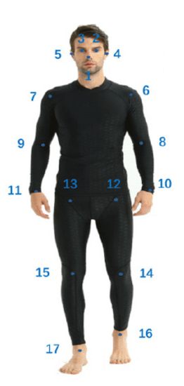
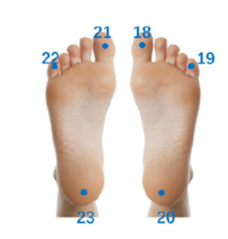
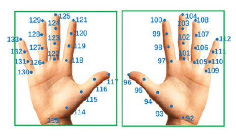
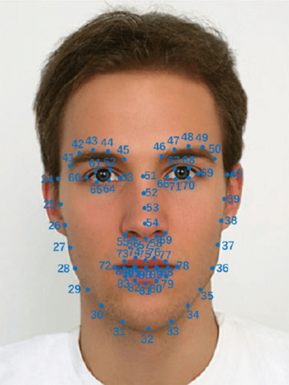

# Components

NICE Toolbox incorporates a growing set of Computer Vision algorithms to track and identify important visual components of nonverbal communication. The initial release encompasses whole-body pose estimation (body joints, hand joints, and face landmarks), gaze tracking, and movement dynamics calculation (kinematics) for each individual. In addition, it features gaze interaction monitoring (mutual gaze) and the measurement of physical body distance (proximity) between dyads. 

The output of each component is saved in the corresponding component folder as an `<algorithm_name>.npz` file. The .npz file serves as a container that holds multiple arrays in the .npy format. The results for different algorithms were provided separately. The code snippet below shows how you can access the content of an .npz file in Python:

```
import numpy as np

# load the file
arr = np.load("path/to/file.npz", allow_pickle=True)

# to see all arrays and dictionaries inside
print(arr.files)

# arrays can be accessed as usual
print(arr['3d'].shape)
print(arr['3d'][:, 0])

# there is always a dictionary describing all available arrays and what to find in each their dimensions
print(arr['data_description'].item())

# array axis descriptions for array '3d':
print(arr['data_description'].item()['3d'])

```

Additionally, if the `save_csv` parameter is set to true in the [`./configs/detectors_run_file.toml`](../../configs/detectors_run_file.toml) file, the outputs will also be saved in the csv_files folder as separate CSV files. Again, the results for different algorithms are provided separately.

The detected components are detailed below.

[Individual Components](#body-joints)
- [Body joints](#body-joints)
- [Hand joints](#hand-joints)
- [Face landmarks](#face-landmarks)
- [Gaze individual](#gaze-individual)
- [Kinematics](#kinematics)

[Interpersonal Components](#gaze-interaction)
- [Gaze Interaction](#gaze-interaction)
- [Proximity](#proximity)

<br>

## Body joints
Identifies and tracks the position of key body joints, (e.g., shoulders, elbows) to analyze body posture and movements. Available algorithms are *HRNet-w48* and *ViTPose*. The figure below illustrates the key body joints identified. *ViTPose* estimates full-body joints, including arms, shoulders, hips, wrists, and ankles, but excludes foot-specific joints like heels and toes. *HRNet-w48* includes these additional foot joints.

[](../graphics/body_joints.png)
[](../graphics/foot_joints.png)


The CSV files containing the <body_joints> key and the `<output_folder>/body_joints/<algorithm_name>.npz` file represent the results of this component. 

The algorithms estimate the position of joints in 2D (x and y coordinates) along with a confidence score for each joint. The `…_2d.csv` files and `2d.npy` data is saved inside the `<output_folder>/body_joints/<algorithm_name>.npz` file represent the raw output of the algorithm. These 2D estimates are further refined during post-processing. 

The algorithm's results are smoothed in post-processing using Savitzky-Golay filter (see `…_2d_filtered.csv` or `2d_filtered.npy` file). This smoothing helps mitigate the well-known flickering issue in pose estimation but may also smooth out small, meaningful movement changes. Filtering is optional and users can deactivate or fine-tune its parameters (see `frameworks.mmpose.filtered`, `frameworks.mmpose.window_length`, and `frameworks.mmpose.polyorder`  parameters in the [`./configs/detectors_config.toml`](../../configs/detectors_config.toml) file.

Joint estimations with a confidence score below 0.60 are marked as missing because they often indicate an occluded joint or an incorrect estimate. These likely incorrect estimations are replaced with missing values, and linear interpolation is applied between the last two non-missing estimates of the joint. If the gap exceeds 1/3 of a second, the joint positions remain empty (see `…_2d_interpolated.csv` or `2d_interpolated.npy` file).

With calibrated stereo cameras, the 3D positions (x, y, and z coordinates) of the body joints are computed via the triangulation method (see `..._3d.csv` or `3d.npy` file). Since 3D estimation is performed after interpolation of the 2D estimations, any missing 2D joint point will also be missing in the 3D results.
If the user has more than two camera views, the first two camera views listed in the `frameworks.mmpose.camera_names` parameter in the [`./configs/detectors_config.toml`](../../configs/detectors_config.toml) file will be used for triangulation.

## Hand joints
Tracks the positions of hand joints to analyze hand movements and gestures. Available algorithm is *HRNet-w48*. The figure below represents the identified hand joints.

[](../graphics/hand_joints.png)

The CSV files containing the <hand_joints> key and the `<output_folder>/hand_joints/<algorithm_name>.npz` file represent the results of this component. The post-processing steps and naming conventions are the same as those used for body joints.

## Face landmarks
Detects the position of key landmarks to analyze facial expressions and movements. Available algorithm is *HRNet-w48*. The figure below represents the identified face landmarks. 

[](../graphics/face_lanmarks.png)

The CSV files containing the <face_landmarks> key and the `<output_folder>/face_landmarks/<algorithm_name>.npz` file represent the results of this component. The post-processing steps and naming conventions are the same as those used for body joints.

## Gaze Individual
Tracks the individual's gaze using the *XGaze_3cams* algorithm. The CSV files containing the <gaze_individual> key and the `<output_folder>/gaze_individual/<algorithm_name>.npz` file represent the results of this component.

The algorithm first detects the eye region and then calculates the 3D gaze direction. It is capable of tracking gaze in 3D space even with a single camera. When multiple cameras are used, the algorithm aggregates gaze detection results from each camera that captures the subject's gaze.

The `…_3d.csv` file and `3d.npy` data is saved inside the `<output_folder>/gaze_individual/<algorithm_name>.npz` contains the 3D gaze direction, with the starting point derived from the position of the eye. The 2D eye region positions are stored in `…_landmarks_2d.csv` and `landmarks_2d.npy` file.

Gaze direction results of the algorithm are further smoothed during post-processing using Savitzky-Golay filter (see `…_3d_filtered.csv` or `3d_filtered.npy` file). Filtering is optional and users can deactivate or fine-tune its parameters (see `algorithms.xgaze_3cams.filtered`, `algorithms.xgaze_3cams.window_length`, and `algorithms.xgaze_3cams.polyorder` parameters in the [`./configs/detectors_config.toml`](../../configs/detectors_config.toml) file).

## Kinematics
The *velocity-body* algorithm analyzes the movement dynamics of body joints by calculating their displacement and velocity. The CSV files containing the <kinematics> key and the `<output_folder>/kinematics/<algorithm_name>.npz` file represent the results of this component.

The displacement vectors for each body joint, calculated per camera view, are stored in the `…_displacement_vector_body_2d.csv` and `displacement_vector_body_2d.npy` data is saved inside the `<output_folder>/kinematics/<algorithm_name>.npz`. The velocity values, also computed per camera view, are stored in the `…_velocity_body_2d.csv` and `velocity_body_2d.npy` file.

When using calibrated stereo cameras, the algorithm computes 3D movement dynamics as well (see `…_displacement_vector_body_3d.csv`/`displacement_vector_body_3d.npy` and `…_velocity_body_3d.csv`/`velocity_body_3d.npy`).

## Gaze Interaction
Monitors the gaze interaction between dyads (mutual-gaze) to provide more insights into the communication dynamics. The CSV files containing the <gaze_interaction> key and the `<output_folder>/gaze_interaction/<algorithm_name>.npz` file represent the results of this component.

The *gaze-distance* algorithm measures the Euclidean distance between an individual’s gaze vector and the position of another person’s face (results are stored in `…_distance_gaze_3d.csv` and `distance_gaze_3d.npy` data is saved inside the `<output_folder>/gaze_interaction/<algorithm_name>.npz`). 

If the measured distance is below a predefined threshold, the algorithm labels the gaze as directed at the other person’s face (see `…_look_at_3d.csv` or `look_at_3d.npy` file). Additionally, the algorithm detects 'mutual gaze' when both individuals are simultaneously looking at each other's face (see `…_gaze_mutual_3d.csv` or `gaze_mutual_3d.npy` file).

## Proximity
The *body-distance* algorithm measures the physical proximity between dyads by calculating between user-defined joint/s. 

For each camera view, the algorithm computes this distance based on the 2D positions of the selected joints (see `...body_distance_2d.csv` or `body_distance_2d.npy` data is saved inside the `<output_folder>/proximity/<algorithm_name>.npz`). With calibrated stereo cameras, the algorithm's measurement is based on 3D position of the joint/s (see `...body_distance_3d.csv` or `body_distance_3d.npy` file). 

