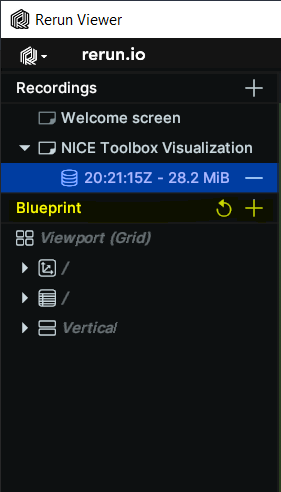
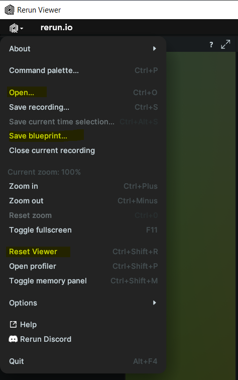

# Understanding the config files


The configuration files are Python dictionaries saved in `.toml` - files that contain details about the machine on which the toolbox is running, the experiment that runs, the data the toolbox runs on, the detectors and algorithms it is using, a mapping between different data identifiers, as well as the visualization that shows the toolbox's results. Most of these configuration dictionaries may contain placeholders which are explained first.

<br>

- [Placeholders](#placeholders)
- [Machine specifics](#machine-specifics)
- [Run file](#run-file)
    - [General properties](#general-properties)
    - [Choosing algorithms per component](#choosing-algorithms-per-component)
    - [Defining the experiments](#defining-the-experiments)
    - [Input and output files](#input-and-output-files)
- [Dataset properties](#dataset-properties)
- [Detectors config](#detectors-config)
    - [Method detectors](#method-detectors)
    - [Feature detectors](#feature-detectors)
- [Predictions mapping](#predictions-mapping)
- [Visualizer config](#visualizer-config)

<br>


## Placeholders

Placeholders can be put into strings and are filled automatically during run-time. All configs support the use of placeholders, where reasonable.
Placeholders are indicated by enclosing characters `<` and `>` and may take the following values:
1. All keys in `./machine_specific_paths.toml`,
2. All keys from `io` as defined in `./configs/detectors_run_file.toml`,
3. The keys `<dataset_name>`, `<component_name>`, `<algorithm_name>`, `<session_ID>`, `<sequence_ID>`, `<camera_name>`, `<video_start>`, and `<video_length>` that define the current experiment run are filled during program execution based on the specifications in the run file `./configs/detectors_run_file.toml`,
4. The options `<git_hash>`, `<me>`, `<today>`, `<yyyymmdd>`, `<time>`, and `<pwd>`.


Some examples:

- The default output folder path defined in the [run file's io](#defining-input-and-output-files) is `"<output_folder_path>/experiments/<experiment_name>"`. During run time, the placeholder `<output_folder_path>` is filled from the [machine specifics](#machine-specifics) dictionary and the `<experiment_name>` is replaced by the value defined in the same dictionary as the output folder path, the [run file's io](#defining-input-and-output-files).
- A typical example value for the data_input_folder in a [dataset's properties](#dataset-properties) is `"<datasets_folder_path>/test_dataset/<session_ID>/<camera_name>"`. The `<datasets_folder_path>` is filled from the [machine specifics](#machine-specifics) dictionary and both `<session_ID>` and `<camera_name>` are filled during run time individually for each experiment, as defined in the run file's [experiment selection](#defining-the-experiments).


## Machine specifics

The dictionary stored in the `./machine_specific_paths.toml` file configures the paths that are specific to the machine used for running NICE Toolbox. This is the **only occurrence of absolute paths** in the codebase. Therefore, this file is part of the repository's `.gitignore` file and needs to be created new on each machine. A template is available as `./machine_specific_paths_template.toml`, which can be duplicated and renamed.

```toml
datasets_folder_path = ''
output_folder_path = ''
conda_path = ''
```
- `datasets_folder_path` is the absolute path to the directory in which all datasets are stored (str).
- `output_folder_path` defines the absolute path to the directory in which all toolbox output is saved (str).
- `conda_path` contains the absolute path to the conda installation on the machine (str).


## Run file

The run file `./configs/detectors_run_file.toml` defines the experiments to run. This config consists of four parts, that detail general properties, the chosen detectors, the dataset(s), and the experiment's output files. The config supports placeholders as described [here](#placeholders). Each part is described in the following.


### General properties

Properties that apply to all experiments.

```toml
git_hash = "<git_hash>"
visualize = true
save_csv = true
```
- `git_hash` is the identifier/hash of the current git commit (str), it is filled automatically by default.
- `visualize` enables saving of intermediate results per detector (bool). Disable for a faster run time, enable for test runs of smaller data subsets and debugging.
- `save_csv` enables saving all results to 2d tables in csv-files (bool).


### Choosing algorithms per component

Each component can be assigned to and run with multiple different algorithms. When choosing a component to run, as described in [defining the experiment](#defining-the-experiments), this dictionary maps to the corresponding algorithm(s) that will run to predict the specific component.

```toml
[component_algorithm_mapping]
gaze_individual = ['multiview_eth_xgaze']
gaze_interaction = ['gaze_distance']
body_joints = ['hrnetw48', 'vitpose']
hand_joints = ['hrnetw48']
face_landmarks = ['hrnetw48']
kinematics = ['velocity_body']
proximity = ['body_distance']
leaning = ['body_angle']
emotion_individual = ['py_feat']
```
- The dictionary keys are all implemented component names (str).
- Per component, the value (list of str) lists which algorithms should run for its prediction. Note: One algorithm may predict multiple components and multiple algorithms may be chosen per component.


### Defining the experiments

NICE Toolbox supports running multiple experiments with different components and datasets sequentially from a single program call.
Hereby, experiments on multiple datasets as well as multiple experiments per dataset are possible.
Each experiment uses detectors to predict a set of diverse components.

`[run]` is the dictionary defining these experiments. Each key is a dataset's name, the values specify the experiments to run with this dataset. This is how it looks:

```toml
[run.dataset_name]
components = ["body_joints", "gaze_individual", "gaze_interaction", "kinematics", "proximity", "leaning", "emotion_individual]
data_selections = [
    {session_ID = "", sequence_ID = "", video_start = 0, video_length = 100},
    ...
]
```
- `components` lists the components that are predicted for this dataset (list of str).
- `data_selections` defines which data of the chosen dataset to run on (list of dict). Each dictionary of the form `{session_ID = "", ...}` selects one video snippet to run and defines a new experiment. Multiple such dictionaries, or experiments, in this list will run sequentially.
    - `session_ID` select the dataset's session (str), must match a session_ID defined in the [dataset's properties](#dataset-properties).
    - `sequence_ID` select the dataset's sequence, if applicable, may be an empty string (str, optional), must match a sequence_ID defined in the [dataset's properties](#dataset-properties).
    - `video_start` starting point in frames, 0 for starting from beginning of the video (int), must not exceed the total number of frames.
    - `video_length` number of frames to run, defines the length of the selected video (int), video_start + video_length must not exceed the total number of frames.

```{note}
The [folder structures](../tutorials/tutorial1_dataset_single_view.md#folder-structure) of a dataset inside the NICE Toolbox are designed such that the session ID and, if applicable, the sequence ID of a given dataset clearly define one video (stored as a video file or frames) of the data. The keys video_start and video_length refer to this video.
```


### Input and output files

The last part of the run file specifies where inputs can be found and any output of the NICE Toolbox gets saved.

```toml
[io]
experiment_name = "<yyyymmdd>"
out_folder = "<output_folder_path>/experiments/<experiment_name>"
out_sub_folder = "<out_folder>/<dataset_name>_<session_ID>_s<video_start>_l<video_length>"
dataset_properties = "configs/dataset_properties.toml"
detectors_config = "configs/detectors_config.toml"
assets = "<code_folder>/nicetoolbox/detectors/assets"

process_data_to = "data_folder"
data_folder = "<output_folder_path>/nicetoolbox_input/<dataset_name>_<session_ID>_<sequence_ID>"
tmp_folder = "<output_folder_path>/experiments/tmp"
detector_out_folder = "<out_sub_folder>/<component_name>/<algorithm_name>/detector_output"
detector_visualization_folder = "<out_sub_folder>/<component_name>/<algorithm_name>/visualization"
detector_additional_output_folder = "<out_sub_folder>/<component_name>/<algorithm_name>/additional_output"
detector_tmp_folder = "<tmp_folder>/<component_name>/<algorithm_name>"
detector_run_config_path = "<out_sub_folder>/<component_name>/<algorithm_name>"
detector_final_result_folder = "<out_sub_folder>/<component_name>"
csv_out_folder = "<out_folder>/csv_files"
code_folder = "<pwd>"
conda_path = "<conda_path>"
```
- `experiment_name` define the name under which all experiments are run (str), defaults to today's date (in format YYYMMDD).
- `out_folder` is the top level directory where the results of all experiments are saved (str).
- `out_sub_folder` is the output directory for a single experiment run (str).
- `dataset_properties` and `detectors_config` store where to find the config files [dataset properties](#dataset-properties) and [detectors config](#detectors-config) (str).
- `assets` stores the folder path of additional assets, like model checkpoints and weights (str). See [download assets](../installation.md#2-download-assets) in the installation instructions.
- `process_data_to` currently only supports the option "data_folder" (str), defined in the next line.
- `data_folder` is the path to the directory in which pre-processed input data gets stored during run time (str). As different algorithms require different file formats and folder structures as input, the NICE Toolbox prepares the given data accordingly. This pre-processed data is stored/cashed for faster run times when repeating runs over the same data.
- `tmp_folder` currently not yet supported (str).
- `detector_out_folder`, `detector_visualization_folder`, `detector_additional_output_folder`, `detector_tmp_folder`, `detector_run_config_path`, and `detector_final_result_folder` define where each detector stores (possible) intermediate outputs (str). Depending on the components and algorithms run per detector and the [visualization settings](#general-properties), different intermediate outputs are produced. The final results of all components and algorithms per detector are saved under `detector_final_result_folder`.
- `code_folder` names the machine's folder path to the nicetoolbox repo (str), by default, it is filled automatically.
- `conda_path` names the folder path to the machine's conda installation (str), by default, it is filled automatically.


## Dataset properties

Properties that are specific per dataset are collected in `./configs/dataset_properties.toml`. For each dataset, these include:

```toml
[dataset_name]
session_IDs = ['']
sequence_IDs = ['']
cam_front = ''
cam_top = ''
cam_face1 = ''
cam_face2 = ''
subjects_descr = []
cam_sees_subjects = {}
path_to_calibrations = ""
data_input_folder = ""
start_frame_index = 0
fps = 30
```
- `session_IDs` lists all identifiers of the dataset's sessions (list of str).
- `sequence_IDs` lists all identifiers of the dataset's sequences (list of str, optional).
- `cam_front` contains the name of the camera view that observes the scene from the front (str). Best, it faces the subjects at about eye-height.
- `cam_top`, `cam_face1`, and `cam_face2` are the names of optional additional camera views for multi-view predictions (str, optional). These cameras include a frontal view from top and views of one or two subject's faces.
- `subjects_descr` lists identifiers for the subjects in each video or frame, ordered from left to right (list of str). The number of identifiers must match the number of people visible in the videos/frames.
- `cam_sees_subjects` defines which camera view records which subject (dict: (cam_name, list of int)). It is a dictionary with the camera_names from above as keys. For each camera, the value describes the subjects it observes from left to right. Hereby, each subject is represented by its index in subjects_descr, where indexing starts with 0.
- `path_to_calibrations` defines the path to the calibration files (str, optional). It likely contains the placeholder `<datasets_folder_path>`.
- `data_input_folder` defines the path to the video or image files of the dataset (str). It likely contains placeholders such as `<datasets_folder_path>`, `<session_ID>`, and `<sequence_ID>`.
- `start_frame_index` details how the dataset indexes its data (int). Typically, frame indices start with 0 or 1.
- `fps` is the frame rate of the video data (int).


## Detectors config

Internally, there are two types of detectors: method and feature detectors. For both, the configurations are defined inside the `./configs/detectors_config.toml` file.


### Method detectors

For method detectors, the required properties are:
```toml
[algorithms.algorithm_name]
input_data_format = "frames"
camera_names = [""]
env_name = "env_type:env_id"
```
- `input_data_format` describes which input type the algorithm expects (str). The currently supported option is "frames".
- `camera_names` lists the camera views (as placeholders) of which the algorithm takes input data (list of str). Current options are "<cam_front>", "<cam_top>", "<cam_face1>", "<cam_face2>".
- `env_name` defines the python or conda environment for running the algorithm (str). Options are "venv:env_id" for a python environment and "conda:env_id" for a conda environment, in both cases "env_id" is to replaced by the environment's name.


### Feature detectors

Feature detectors require the properties
```toml
[algorithms.algorithm_name]
input_detector_names = [["component_name", "algorithm_name"]]
```
- `input_detector_names` (list of list of str)


## Predictions mapping

The config file `./configs/predictions_mapping.toml` contains information about mappings between different data identifiers. These are, for example, different conventions for selecting and naming human body joints, also called keypoints. The mappings are primarily used for internal purposes.


## Visualizer Config

Defined in `./configs/visualizer_config.toml`.

Visualizer Config consists of three main part io, media, and component specifications.

```toml
[io]
dataset_folder = "<datasets_folder_path>"                                 # main dataset folder
nice_tool_input_folder = "<output_folder_path>/raw_processed/isa_tool_input/<dataset_name>_<session_ID>_<sequence_ID>" # raw_processed input data
experiment_folder = "<output_folder_path>/experiments/20240906_mm"        # NICE Toolbox experiment output
experiment_video_folder = "<experiment_folder>/<video_name>"              # NICE Toolbox output folder for the specific video.
experiment_video_component = "<experiment_video_folder>/<component_name>" # NICE Toolbox output folder for the specific component

[media]                                # each Media session shows one video results.
dataset_name = 'mpi_inf_3dhp'          # dataset of the video
video_name = 'mpi_inf_3dhp_S1_s20_l20' # name of video result folder
multi_view = true                      # true if you have multiple cameras, otherwise set it to false
[media.visualize]                      # specify what will be visualized
components = [..]                     # list of components
camera_position = true                 # true if you want to visualize camera position -- requires extrinsic information of the camera
start_frame = 0                        # starting frame for the visualization
end_frame = -1                         # end frame for the visualization, -1 means process until the end of the video
visualize_interval = 1                 # 1 means visualize every frame; change the parameter accordingly if you want to visualize every x frames
```
### Configuring Component Data Display in Rerun Windows
You can control which data will be shown in specific rerun windows by adjusting the 'media.component.canvas' items
The keys (like '3d' or '2d_interpolated') represent different type of data provided by that component.
The value lists define which canvases (rerun windows) will show the data
1. '3D_Canvas': This shows data in the 3D canvas. It is only for multi-view datasets. (Do not change the canvas name).
2. Cameras: Data will be visualized on that specific camera image. The camera name must match the camera placeholder names in dataset_properties.toml
3. Metrics - The displays the data as plots.
4. Empty list: If you don't want the data to be visualized, leave the list empty.

**Configuring Algorithm Display**
Under 'media.component', the algorithms parameter let you choose which algorithms to display.
For example, if you have multiple algorithms (e.g., hrnetw48 and vitpose in the body_joints component),
you can specify which algorithm’s results to show.
If you want to see results from both algorithms, list both names.

**Configuring Appearance**
Under 'media.component.appearance', you can configure the color and radii (the size of the dots and lines).

```toml
# Component: gaze individual - An example for 3D_Canvas and Camera Canvases
[media.gaze_individual]
algorithms = ['multiview_eth_xgaze']  # list of algorithms
[media.gaze_individual.canvas]
3d_filtered = ["3D_Canvas", "<cam_face1>", "<cam_face2>", "<cam_top>", "<cam_front>"] ## key options 3d, 3d_filtered ## value options: [3D_Canvas], [3D_Canvas, camera names], [camera names], []
                                                                                      ## Note: Delete '3D_Canvas' if you don't have a multi-view setup.
[media.gaze_individual.appearance]
colors = [[0,150, 90]]                  # define the color of individual gaze
radii = {'3d'= 0.01, 'camera_view'= 4}  # define the size of gaze arrow in 3D_Canvas and camera views

# Component: kinematics  - An example for Metrics Display
[media.kinematics]
algorithms = ['velocity_body']

[media.kinematics.canvas]
velocity_body_3d = ["metric_velocity"] # if don't have multi-view, use velocity_body_2d
#velocity_body_2d = ["metric_velocity"]

[media.kinematics.joints]              # visualize the mean velocity for the given bodyparts.
"head" = ["nose","left_eye","right_eye","left_ear","right_ear"]
"upper_body" = ["left_shoulder","right_shoulder","left_elbow", "right_elbow", "left_wrist", "right_wrist"]  # Indices of keypoints belonging to the upper body
"lower_body" = ["left_hip", "right_hip", "left_knee", "right_knee", "left_ankle", "right_ankle"]

```
### Configuring Rerun Viewer and Blueprint in Rerun
When Rerun is initiated, it automatically creates a heuristic view for the windows.
You can manually change this by dragging the windows or adding new ones using the plus sign next to the Blueprint menu.



This Blueprint can be saved using the 'Save blueprint...' menu option and reopened later using the
'Open' option. Once you configure the Rerun viewer, it will use the same blueprint for future sessions.
You can reset the layout by clicking 'Reset Blueprint.'



If your new video does not have certain windows that the old dataset had, unused empty windows may appear.
To get a fresh heuristic layout, reset the blueprint.
